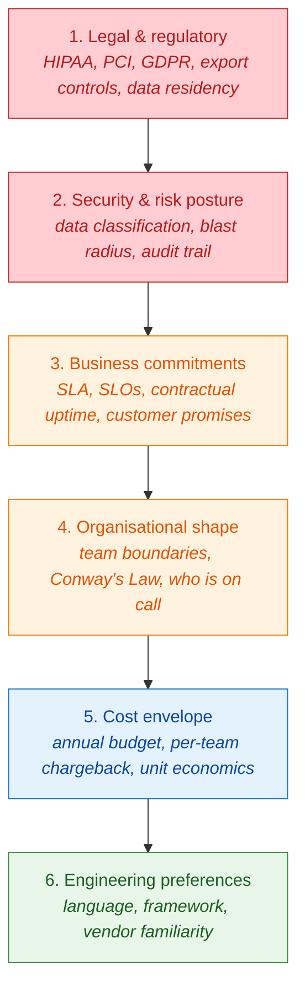
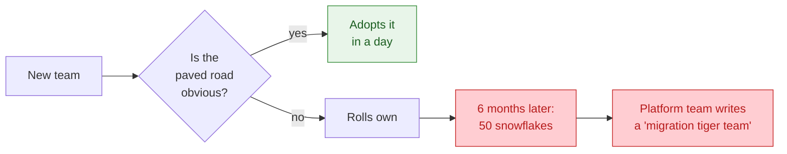
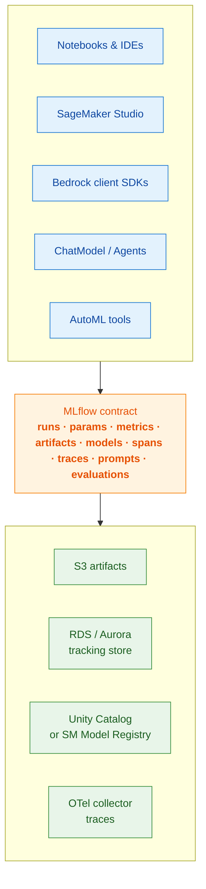

# 00 — Architectural Thinking for ML Platforms

> *"Architecture is the set of decisions that are expensive to change later."* — every staff engineer eventually.

Before we name a single AWS service, we need a working method. Most ML platform redesigns fail not because the team picked the wrong database, but because they answered the wrong question. This document is the lens we use throughout the rest of this series.

## 1. Platform vs product — the distinction that decides everything

A **product** serves users with a specific outcome (a fraud score, a recommendation, a chatbot answer). A **platform** serves *teams that build products* — its users are other engineers and data scientists.

| Dimension | Product team | Platform team |
|---|---|---|
| **Customer** | End user / internal business team | Other engineers, data scientists, ML engineers |
| **KPI** | Business metric (revenue, latency, conversion) | Adoption, time-to-first-model, paved-road coverage, $/team |
| **Failure mode** | Bad predictions | Teams route around you and rebuild your service themselves |
| **Optimisation** | Specific use case | The 80% case that ten teams share |

This distinction matters because *every architectural choice in this series should be graded against platform metrics, not product metrics*. A platform that gives one team a 5% accuracy lift but costs another team a week of integration is a net-negative platform.

> **Heuristic:** if the answer to "should we add this feature?" is "yes, because team X needs it," ask "and what does team Y, who doesn't need it, pay for it?" Optionality is rarely free.

## 2. The constraint hierarchy

Constraints are not equal. They flow downward, and lower constraints cannot override higher ones. Get this order wrong and you will spend a year rebuilding.

**Read the diagram top-to-bottom.** A regulatory constraint (level 1) can force a more expensive architecture (level 5) and override an engineering preference (level 6). The reverse is never true — you cannot decide that you "prefer Postgres on EC2" if SOC2 requires a managed, encrypted, audited database.

In practice, most teams *invert* this hierarchy. They start at level 6 ("we like X") and rationalise upward. The architecture council's job is to keep the order honest.

## 3. The architecture council — five voices, one decision

We will write the rest of this series as if produced by five collaborating roles. They map to real seats around a real table.

| Role | Asks | Penalises |
|---|---|---|
| **Platform tech lead** | "Will ten teams use this?" | Bespoke per-team work |
| **Infra / SRE lead** | "What happens at 3am when this breaks?" | Hidden state, manual runbooks |
| **Security & compliance** | "Who has access to what, audited how?" | Implicit trust, broad IAM |
| **ML researcher / staff DS** | "Will this make my models better, or just shinier?" | Process for process's sake |
| **Finance / FinOps** | "What does this cost per team, per model, per call?" | Untagged spend, free-for-all GPUs |

Throughout the rest of this series, when we surface a tradeoff, we will name which voice is making which case. This is not a literary device — it is how to keep arguments productive instead of ideological.

## 4. The three-question filter for every architectural choice

Before we adopt any pattern in the rest of this site, we apply three questions:

### Q1. What does this make easy that was hard before?

If the answer is "nothing concrete," the pattern is decoration. Example: adding a service mesh to an ML platform that has six services and no traffic-shaping requirement adds operational surface for no gain.

### Q2. What does this make hard that was easy before?

Every abstraction taxes someone. Adding a feature store makes feature reuse easy and makes ad-hoc experimentation harder. That trade may be worth it for fraud, but be wrong for a research team.

### Q3. Is the change reversible?

Reversible decisions can be made fast and cheaply, with rollback. Irreversible ones (data model in your tracking store, your tenancy model, your account topology, your KMS key strategy) deserve weeks of design.

> **Rule of thumb:** spend design effort proportional to *how expensive the unwind is*, not how exciting the technology is.

## 5. The "platform as a multiplier" mental model

A platform's value is not its own throughput. It is the **multiplier it applies to the teams that use it**.

If you have 50 teams and your platform saves each one 4 weeks per year, you have produced 200 engineer-weeks. If your platform costs 3 engineers to run, you have a 65× multiplier. If it costs 30 engineers (because every team needs hand-holding), you have a 7× multiplier — still positive, but you are now competing with "teams just doing it themselves on EC2."

This is why **paved roads beat policies**. A paved road is the easy default that does the right thing automatically (right IAM, right encryption, right tagging, right MLflow tracking, right registry promotion gates). A policy is a document that says "you must." Paved roads scale; policies don't.

## 6. The "thin waist" principle

The internet won because IP is a thin waist: many things above it (HTTP, gRPC, video), many things below it (Ethernet, fibre, 5G). MLflow plays a thin-waist role in an ML platform — many tools above (notebooks, training jobs, agents), many backends below (S3, RDS, Postgres, SageMaker MLflow).

Designing a platform means deciding *what is above and below your thin waist*, and resisting the urge to thicken it. The closer the waist is to a stable, simple contract (runs, params, metrics, artifacts; spans, traces, prompts, evaluations), the more durable your platform is across changes in fashion.

## 7. How to apply this when reading the rest of the series

When you read the team scenarios in [02](02-team-personas-and-scenarios.html), the constraints in [05](05-constraints-impact-matrix.html), or the AWS deep-dives in [03](03-mlflow-on-sagemaker.html) and [04](04-mlflow-with-bedrock.html), keep four questions on your desk:

1. **What level of the constraint hierarchy is at play?** (Don't let level 6 win.)
2. **Which voice on the council is being optimised for?** (Surface the tradeoff.)
3. **Is the decision reversible?** (Match design rigor to cost-of-unwind.)
4. **Does it make the paved road wider, or just longer?** (Multiplier > features.)

That is the entire method.

Continue with [The 12 platform layers →](01-platform-layers.html).
