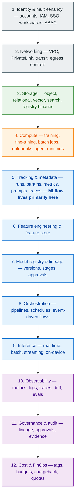
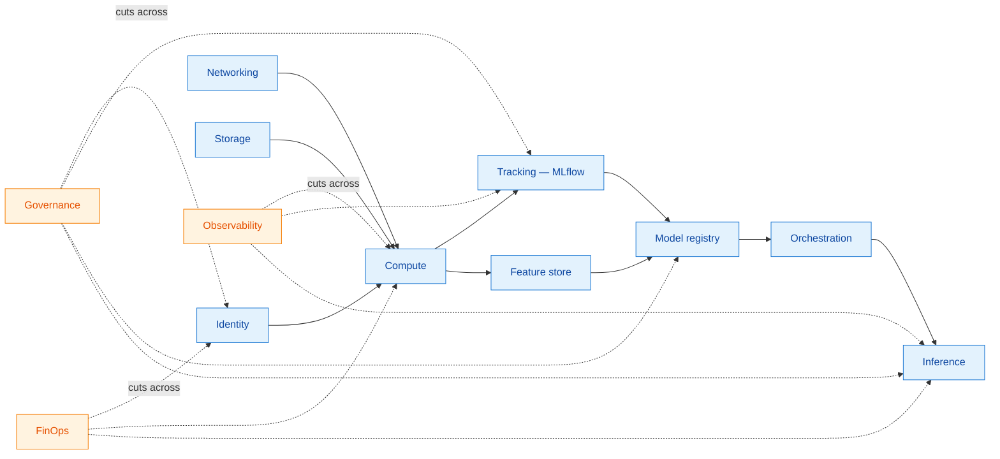

# 01 — The 12 Platform Layers

A real ML/AI platform inside an Amazon-scale company is not three boxes ("data, models, serving"). It is a layered system where each layer has a contract, a set of failure modes, and an owner. If your platform diagram has fewer than ten distinct layers, someone is doing extra work in their evenings.

This document defines the **twelve layers** we will refer back to throughout the rest of this series, and the role MLflow, SageMaker, and Bedrock play in each.

## The reference picture

The layering is *logical*, not strict — a real architecture has cross-cutting concerns (e.g. observability touches every layer). But the order roughly matches *what you must decide first* when you stand up a new platform: identity before networking, networking before storage, storage before compute, compute before tracking, and so on.

We now walk each layer.

---

## Layer 1 — Identity & multi-tenancy

**What it does.** Decides who your tenants are (teams, BUs, regulated subsidiaries), how they map to AWS accounts, and how identity flows from corporate SSO into AWS, MLflow, SageMaker, and Bedrock.

**AWS services.** AWS Organizations, Control Tower, IAM Identity Center (formerly SSO), IAM, STS, KMS (key policies are an identity decision), Resource Access Manager (RAM).

**MLflow's role.** MLflow has a workspace concept (see this fork's `tests/store/tracking/test_sqlalchemy_store_workspace.py` and the workspace plumbing called out in `CLAUDE.md`). The platform decides whether one MLflow tracking server serves many workspaces, or each tenant gets their own.

**Key choices.**
- **Account-per-team vs shared account with workspaces.** Account-per-team is the AWS-native answer (clean blast radius, clean cost, IAM stays simple). Shared-account-with-workspaces is the MLflow/Databricks-native answer (cheaper, more uniform, harder to isolate). Most large orgs end up with both: account-per-BU, workspaces inside.
- **ABAC vs RBAC.** ABAC (attribute-based: tags on principals and resources) scales to thousands of teams; RBAC explodes into thousands of roles. Pick ABAC for anything you expect to grow.
- **Service-linked roles vs assumed roles.** SageMaker, Bedrock, and Lambda all want service-linked roles. Audit them — the default permissions are broad.

**Failure modes.**
- "We use one account for all of ML." Works at 5 teams. Breaks at 50 (IAM policy size limits, blast radius, cost attribution).
- "Each team manages their own KMS keys." Now key rotation is a 50-team coordination problem.
- "We let researchers self-serve workspaces." Now you have 1,200 workspaces, 800 of them dead.

**Owner.** Cloud platform / IAM team, with the ML platform team as customer.

---

## Layer 2 — Networking

**What it does.** Connects compute, storage, and SaaS endpoints without leaking traffic to the public internet, and gives security a place to enforce egress controls.

**AWS services.** VPC, subnets, route tables, Transit Gateway, PrivateLink (VPC endpoints), AWS Network Firewall, Route 53 Resolver, Direct Connect / Site-to-Site VPN.

**MLflow's role.** MLflow tracking server, artifact store, and registry are all reached via network endpoints. The platform must decide: are they reachable from the public internet? From corp network only? From workloads only via VPC endpoints?

**Key choices.**
- **VPC endpoints for S3, KMS, STS, SageMaker API, Bedrock runtime.** Without these, traffic egresses to the public AWS endpoints — usually fine, sometimes a compliance problem, always a cost problem at scale (NAT egress fees).
- **Egress allow-list vs deny-list.** Regulated workloads need allow-list egress (only Bedrock, S3, internal SaaS reachable). General research workloads usually live with deny-list (most things reachable, known-bad blocked).
- **Multi-VPC vs hub-and-spoke.** Hub-and-spoke via Transit Gateway scales to hundreds of VPCs. Per-VPC peering does not.

**Failure modes.**
- NAT gateway bills exceed compute bills. (Real story; happens when SageMaker training jobs pull from public PyPI through a NAT.)
- Bedrock calls leave the VPC because no `bedrock-runtime` VPC endpoint was set up. Compliance audit catches it months later.

**Owner.** Cloud network team. ML platform team consumes the VPC abstractions.

---

## Layer 3 — Storage

**What it does.** Persists everything: training data, features, model artifacts, MLflow's tracking metadata, vector indexes, prompt libraries, evaluation traces.

**AWS services.**
- **Object:** S3 (artifacts, datasets, MLflow `artifact_uri`, OTel trace dumps).
- **Relational:** RDS / Aurora Postgres (MLflow tracking & registry store, feature metadata).
- **Vector / search:** OpenSearch with k-NN, Aurora pgvector, S3 Vectors, Bedrock Knowledge Bases (managed RAG).
- **NoSQL / cache:** DynamoDB (online feature store), ElastiCache (low-latency lookups).
- **Filesystem:** EFS (shared notebooks), FSx for Lustre (high-throughput training datasets).

**MLflow's role.** MLflow's [tracking store](../concepts/tracking.html) is one of File/SQL/REST backends. In production on AWS, it is almost always **Aurora Postgres** (HA, point-in-time recovery, encryption at rest with KMS). The artifact store is almost always **S3** with KMS-managed encryption.

**Key choices.**
- **One bucket per workspace vs one bucket with prefixes per workspace.** Per-workspace buckets give clean IAM, clean lifecycle policies, and clean cost. Per-prefix gives fewer buckets to manage. We recommend per-workspace for tenants > a handful.
- **Aurora vs RDS Postgres.** Aurora for anything multi-AZ at scale. RDS Postgres is fine for small teams.
- **S3 Object Lock for model artifacts in regulated workloads.** Models that fed production decisions cannot be silently mutated.
- **Storage class tiering.** Old experiment artifacts → S3 Intelligent-Tiering or Glacier. Expensive without it; trivial with.

**Failure modes.**
- Tracking store grows to 500 GB because no run/trace retention policy exists. Now schema migrations take 6 hours.
- All teams share one S3 bucket; one team accidentally `s3:DeleteObject *`s another team's artifacts.

**Owner.** ML platform team owns MLflow's stores; data platform team owns the data lake; both share lifecycle policy.

---

## Layer 4 — Compute

**What it does.** Runs the work: training jobs, fine-tuning jobs, batch inference, notebooks, evaluation pipelines, agent processes, autoscaling endpoints.

**AWS services.**
- **SageMaker:** Training Jobs, HyperParameter Tuning, Processing Jobs, Studio Notebooks, Pipelines, Autopilot.
- **Bedrock:** managed foundation-model inference (no compute to manage), custom model import, fine-tuning jobs.
- **General compute:** EC2 (capacity blocks, P5/H100/H200 instances), EKS (Karpenter for ML), ECS/Fargate, AWS Batch, Lambda (light orchestration / agent steps).
- **Spot & savings:** Spot for training, Savings Plans for endpoints, Capacity Reservations for big training runs.

**MLflow's role.** MLflow does not provide compute. It logs *into* compute — every training job sets `MLFLOW_TRACKING_URI` and writes runs/metrics/artifacts.

**Key choices.**
- **SageMaker Training Jobs vs raw EKS for training.** SageMaker is the paved road: bring a Docker image, get logs in CloudWatch, get metrics back, no cluster to run. EKS is right when you need fine-grained scheduling, multi-tenant fairness, or specialised hardware partitioning.
- **Bedrock vs self-hosted LLMs on SageMaker / EC2.** Bedrock is operationally cheap; self-hosted is cheaper at very high volume but operationally heavy. Most teams should default to Bedrock and switch only when a specific cost or capability constraint forces them.
- **Spot vs on-demand for training.** Spot is the right default for training that can checkpoint. On-demand for short jobs and time-critical retrains.

**Failure modes.**
- A team runs interactive Studio notebooks on `ml.p4d.24xlarge` overnight. Bill arrives.
- Endpoints are provisioned at peak capacity 24×7 with no autoscaling. Bedrock would have been a tenth the price.

**Owner.** ML platform team for the paved roads (Studio templates, SageMaker images, Pipelines templates). Compute team for capacity planning.

---

## Layer 5 — Tracking & metadata (MLflow's home turf)

**What it does.** Records *what was tried, with what data, with what code, by whom, and how well it worked.* For GenAI: also records prompts, tool calls, span trees, evaluations, judge verdicts.

**AWS / MLflow services.**
- **MLflow Tracking Server** — hosted on Fargate or EKS, behind an internal ALB, backed by Aurora Postgres + S3.
- **SageMaker MLflow (managed)** — AWS-managed MLflow, integrated with IAM, SageMaker Studio, and the SageMaker Model Registry.
- **MLflow Tracing** — for GenAI; spans/traces stored in the same Postgres + S3, optionally exported via OpenTelemetry.

**Key choices.**
- **Self-hosted MLflow vs SageMaker MLflow.** Self-hosted = full control, full ops burden, full multi-region freedom. SageMaker MLflow = no ops, IAM-native, but bound to the SageMaker control plane and AWS regions where it's available. We dive deep into this in [03](03-mlflow-on-sagemaker.html).
- **One tracking server per BU vs one global server.** One global server simplifies cross-team search but creates a single failure domain and a single migration domain. Most large orgs end up with one server per BU/region.
- **Trace retention policy.** GenAI tracing can produce millions of spans per day. Define hot (Postgres, queryable, 30 days) vs cold (S3 Parquet, queryable via Athena, 1 year) tiers from day one.

**Failure modes.**
- Every team has its own MLflow on its own laptop / EC2. There is no platform — there is folklore.
- One global tracking server reaches 2 TB and queries time out. Migration is a six-month project.

**Owner.** ML platform team. This is the layer they live in.

---

## Layer 6 — Feature engineering & feature store

**What it does.** Turns raw data into features that are reusable across teams, consistent between training and serving, point-in-time correct, and discoverable.

**AWS services.** SageMaker Feature Store (online: DynamoDB-backed; offline: S3 + Glue), Glue, EMR, Athena, Redshift. Third-party: Tecton, Feast on AWS.

**MLflow's role.** MLflow's `Dataset` abstraction can record dataset references in runs. Feature lineage from feature store → run → model → endpoint is the connective tissue.

**Key choices.**
- **Centralised feature store vs per-team.** Centralised pays off when several teams use overlapping features (clickstream, user profile). For an ad-hoc research team, a feature store is overhead.
- **Online + offline parity.** The most expensive bug in ML is training/serving skew. The feature store contract must enforce that the same code computes both.

**Failure modes.**
- The feature store has 4,000 features, 80 of which are used. Discoverability is dead.
- Online store backfills are stale; the team learns this only after a week of bad predictions in production.

**Owner.** Data platform team or a dedicated feature platform team; ML platform team consumes.

---

## Layer 7 — Model registry & lineage

**What it does.** Promotes models from experiment to staging to production via a controlled gate, records lineage (what data, what code, what run, what evals), and powers rollback.

**AWS / MLflow services.**
- **MLflow Model Registry** — versions, aliases, descriptions, transitions; the [registry concept doc](../concepts/registry.html) covers internals.
- **SageMaker Model Registry** — Model Packages and Model Package Groups; integrated with SageMaker Pipelines for approval workflows.
- **Unity Catalog** (when integrating with Databricks).

**Key choices.**
- **MLflow Registry vs SageMaker Model Registry.** Use MLflow Registry as the team-facing source of truth for *what model exists and what it's called*. Use SageMaker Model Registry as the deployment-side mirror that drives endpoint creation and approval workflows. Many large orgs run both, with sync.
- **Aliases vs stages.** Aliases (e.g. `@champion`, `@challenger`) are the modern pattern; stages (`Staging`/`Production`) are deprecated in newer MLflow. Don't build new automation on stages.
- **Promotion gates.** A model entering `@production` should require: passing eval suite, signed-off owner, recorded approval, evidence of fairness/bias testing if relevant.

**Failure modes.**
- The "production" model in the registry is not the model actually serving traffic, because deployment was done by hand.
- Approval is a Jira ticket with no link back to the run, dataset, or evaluation. Audit fails.

**Owner.** ML platform team for the registry; product teams for the promotion gates' content.

---

## Layer 8 — Orchestration

**What it does.** Schedules, chains, and event-triggers the pipelines: data prep → feature build → train → eval → register → deploy → monitor.

**AWS services.** SageMaker Pipelines, AWS Step Functions, Amazon MWAA (managed Airflow), EventBridge, Lambda. For GenAI: Step Functions + Bedrock Agents, or DSPy / LangGraph orchestrators wrapped as ChatModels.

**MLflow's role.** Each pipeline step starts a run, logs to MLflow, and reads artifacts from prior runs. MLflow is the *substrate* the orchestrator writes against.

**Key choices.**
- **SageMaker Pipelines vs Step Functions vs Airflow.** SageMaker Pipelines is the SageMaker-native paved road. Step Functions for general AWS-native, complex branching, agent flows. Airflow for teams with existing DAG investments. They coexist; pick the default per team.
- **Push (CI triggers) vs pull (schedule) vs event-driven.** Drift detector → EventBridge → retrain pipeline is the modern pattern.

**Failure modes.**
- Pipeline definitions are committed nowhere; they are clicked together in the SageMaker console.
- Three orchestrators (Airflow, Step Functions, Pipelines) each own different parts. No one knows where a job actually runs.

**Owner.** ML platform team for the paved road; product teams own their pipelines on it.

---

## Layer 9 — Inference

**What it does.** Serves predictions: real-time HTTP endpoints, batch scoring, streaming, async, on-device.

**AWS services.**
- **Real-time:** SageMaker Real-Time Endpoints (single & multi-model), SageMaker Serverless Inference, SageMaker Inference Components (multi-model, multi-tenant on shared GPUs), Lambda (small models), Bedrock for FMs.
- **Async / batch:** SageMaker Batch Transform, SageMaker Async Inference, AWS Batch.
- **Streaming:** Bedrock streaming, SageMaker streaming endpoints, Kinesis-based fan-out.
- **Edge:** SageMaker Edge / Greengrass / Panorama, IoT Core for fleets.

**MLflow's role.** Models in the MLflow registry get deployed to SageMaker via the [`mlflow.sagemaker` deployment plugin](../concepts/serving.html). For GenAI, the [AI Gateway](../concepts/gateway.html) abstracts the inference endpoint behind a unified API; Bedrock is one of its providers.

**Key choices.**
- **Provisioned vs serverless vs Bedrock.** Provisioned for steady high QPS; serverless for spiky low-volume; Bedrock for FMs you don't want to host.
- **Single-model endpoints vs Multi-Model Endpoints (MME) / Inference Components.** MME pays off when you have many small models with similar runtimes; otherwise pay the per-endpoint tax for clarity.
- **Canary, shadow, and A/B routing.** Build it into the paved road. Don't make every team reinvent it.

**Failure modes.**
- Endpoints are oversized "for safety" 24×7; idle GPU bill dwarfs training bill.
- Rollback strategy is "redeploy the previous Docker image, by hand, from memory."

**Owner.** ML platform for the paved road and routing; product team owns its endpoint's SLO.

---

## Layer 10 — Observability

**What it does.** Tells you whether your platform and its models are healthy. Includes infra metrics, application logs, distributed traces, model performance, data drift, prediction drift, GenAI evaluations, and cost.

**AWS / MLflow services.** CloudWatch, CloudWatch Logs, X-Ray, OpenSearch (logs/traces), Managed Prometheus + Managed Grafana, SageMaker Model Monitor, SageMaker Clarify, MLflow Tracing + Evaluation (the [tracing concept doc](../concepts/tracing.html), the [GenAI evaluation doc](../concepts/genai-evaluation.html)).

**Key choices.**
- **One pane of glass.** Infra metrics in CloudWatch + model metrics in MLflow + GenAI traces in MLflow + business metrics in Quicksight = four panes. Choose a primary (often Grafana) and build the others as drilldowns.
- **Drift detection cadence.** Hourly is overkill for forecasting; daily is too slow for fraud. Match the cadence to the model's risk and re-train SLA.
- **Trace sampling for GenAI.** 100% sampling is fine for low-volume agents and prohibitive for high-volume RAG.

**Failure modes.**
- Endpoints are healthy on every metric the platform emits; predictions are nonetheless terrible because no one watches business KPIs.
- Drift alerts fire constantly; everyone mutes them; the one real drift gets missed.

**Owner.** SRE / observability team owns infra; ML platform team owns model and GenAI observability.

---

## Layer 11 — Governance & audit

**What it does.** Produces evidence that the platform is doing what it's supposed to. Lineage, approvals, access logs, model cards, eval reports, fairness assessments, vendor reviews.

**AWS services.** AWS Config, CloudTrail, IAM Access Analyzer, Audit Manager, Macie (data classification), GuardDuty, Security Hub, Bedrock Guardrails (for GenAI). MLflow contributes lineage and evaluation evidence.

**Key choices.**
- **Lineage as a first-class artifact.** Every model in production must answer "what data was it trained on, by whom, with what code commit, evaluated against what suite, approved by whom." MLflow runs + registry transitions are most of this answer; the platform should make it queryable.
- **Audit on the platform's edges, not the team's code.** Trying to audit notebook code is a losing battle. Audit the *handoffs*: data → run, run → registry, registry → endpoint.

**Failure modes.**
- Audit is a yearly fire drill that consumes every senior engineer for a month.
- Compliance evidence is a SharePoint folder maintained by one person.

**Owner.** GRC / compliance team owns the requirements; ML platform team is responsible for making the evidence cheap to produce.

---

## Layer 12 — Cost & FinOps

**What it does.** Attributes spend to teams and use cases, sets quotas, prevents runaway bills, and gives leaders the data to make tradeoffs.

**AWS services.** Cost Explorer, AWS Budgets, Cost & Usage Report (CUR) → Athena, Cost Categories, Tag Policies, Service Quotas, Compute Optimizer.

**Key choices.**
- **Tagging is the cost layer's foundation.** Every resource: `team`, `cost-center`, `env`, `mlflow-experiment-id` (where applicable). If tagging is enforced at provisioning, FinOps is solved; if it isn't, FinOps is folklore.
- **Showback first, chargeback later.** Show teams their spend; only move to internal billing once teams trust the numbers.
- **Quotas as guardrails, not policies.** A `ml.p4d.24xlarge` quota of 0 in dev accounts beats a doc that says "please don't."

**Failure modes.**
- A bedrock-on-demand workload silently costs more than the team's annual budget in two weeks. No one had set a budget alarm.
- 30% of spend is in resources tagged `Environment=null`. Cost-center attribution is a guess.

**Owner.** FinOps team owns the discipline; ML platform team is responsible for paved-road tagging and quota enforcement.

---

## How the layers interact

Layers 1–9 are mostly *vertical* — each one builds on the next. Layers 10–12 are *cross-cutting* — they instrument or constrain every other layer. Most platform redesigns underweight the cross-cutting three until a year in, when an audit, an incident, or a CFO conversation forces them.

## Cheat-sheet: where MLflow lives in each layer

| Layer | Does MLflow live here? | What MLflow contributes |
|---|---|---|
| 1. Identity | Indirect | Workspace concept; user/run attribution |
| 2. Networking | No | (Consumes) |
| 3. Storage | Yes (its own metadata) | Aurora schema, S3 artifact layout |
| 4. Compute | No | (Consumes) |
| 5. Tracking & metadata | **Primary home** | Runs, params, metrics, artifacts, prompts, traces, evals |
| 6. Feature store | Edge | `Dataset` references in runs |
| 7. Model registry | **Primary home** | Versions, aliases, transitions, lineage |
| 8. Orchestration | Edge | Run-as-pipeline-step contract |
| 9. Inference | Edge | `mlflow.sagemaker` deploy, AI Gateway, ChatModel |
| 10. Observability | **Primary for GenAI** | Tracing, evaluation, judge assessments |
| 11. Governance | Edge | Lineage, run-to-registry-to-endpoint chain |
| 12. FinOps | Indirect | Run-level cost tagging hooks |

This map is the orientation we will use in [03 — MLflow on SageMaker](03-mlflow-on-sagemaker.html) and [04 — MLflow with Bedrock](04-mlflow-with-bedrock.html).

Continue with [Team personas & scenarios →](02-team-personas-and-scenarios.html).
