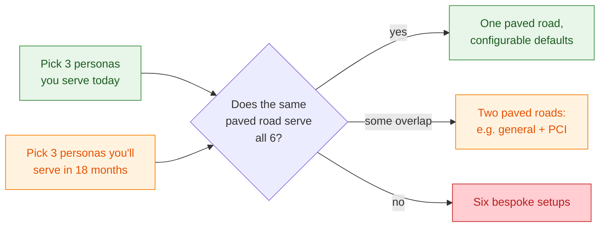

# 02 — Team Personas & Scenarios

A platform that serves "ML teams" generically serves none of them well. Real organisations have a portfolio of teams whose workloads, KPIs, risk profiles, and budgets differ by orders of magnitude. This document profiles **twelve personas** that cover the workload space at a company the size of Amazon and shows how the MLflow / SageMaker / Bedrock platform shifts for each.

For every persona we record:

- **Workload shape** — what the team actually runs.
- **Primary KPIs** — what success means *to them*.
- **Hard constraints** — the things the platform must not violate.
- **MLflow usage pattern** — which parts of MLflow they lean on.
- **AWS service mix** — the dominant SageMaker / Bedrock / supporting services.
- **Platform implication** — what the platform team has to provide for them.

A summary table sits at the bottom.

---

## Persona 1 — Recommendations & personalisation

> *"We retrain ranker every 4 hours. Half a percent of latency is real money."*

- **Workload shape.** Large two-tower / GBDT / sequence rankers. Continuous retraining on streaming click data. Real-time inference at p99 < 50 ms, hundreds of thousands of QPS.
- **Primary KPIs.** Online business metric (CTR, GMV per session), not offline AUC. Latency SLO. Retrain freshness.
- **Hard constraints.** No regressions in tail latency. Safe rollback within minutes. Strict A/B discipline.
- **MLflow usage pattern.** Heavy registry use with `@champion` / `@challenger` aliases. Every retrain run logged with full lineage. Eval gates compare against current champion's offline metric *and* require an online experiment plan.
- **AWS service mix.** SageMaker Training Jobs on Spot for retrains; SageMaker Real-Time Endpoints with Inference Components for multi-model GPU sharing; Feature Store online (DynamoDB-backed); Kinesis for clickstream; Step Functions for the retrain pipeline.
- **Platform implication.** Fast registry → endpoint pipeline. First-class shadow + canary routing. Per-model online metric dashboards. Cost-attribution per ranker version.

---

## Persona 2 — Demand forecasting (retail / supply chain)

> *"We forecast 50M SKUs daily. We don't care about latency, we care about reproducibility."*

- **Workload shape.** Large batch jobs. Hierarchical / probabilistic forecasting (Prophet, GluonTS, DeepAR, classical). Daily or weekly cadence.
- **Primary KPIs.** WAPE / MASE on offline backtests. Reproducibility — last week's forecast must be re-derivable. Pipeline reliability.
- **Hard constraints.** Strict reproducibility (regulatory or audit-driven for some industries). No leakage from future data.
- **MLflow usage pattern.** Tracking is the centerpiece — every forecasting run logs params, dataset hash, code commit, model artifact. Registry is lighter (forecasts often deployed as scored S3 tables, not endpoints).
- **AWS service mix.** SageMaker Processing Jobs or AWS Batch on Spot for the big runs; Athena/Redshift for the upstream warehouse; S3 for inputs and outputs; SageMaker Pipelines for orchestration.
- **Platform implication.** Strong dataset-versioning story (MLflow `Dataset` + S3 versioning + Glue catalog). Long-retention cold storage for run history (audit). Cost-tier the artifact storage aggressively.

---

## Persona 3 — Search relevance (LTR)

> *"Click-through is our oracle. We need a thousand experiments per quarter."*

- **Workload shape.** Many-experiment culture. Learning-to-rank, dense retrieval, hybrid (BM25 + neural). Both batch (index build) and real-time (query-time scoring).
- **Primary KPIs.** Offline MRR/NDCG, plus online interleaving experiments. Volume of validated experiments.
- **Hard constraints.** Latency budget under 30 ms for query-time models. Index update cadence.
- **MLflow usage pattern.** Tracking-heavy. Many experiments, many runs, many comparisons. Less registry pressure (only a few production models at a time).
- **AWS service mix.** SageMaker Studio for interactive experimentation; OpenSearch with k-NN for the index; SageMaker endpoints for query-time scoring; possibly Bedrock embeddings for dense retrieval.
- **Platform implication.** Studio templates that auto-wire MLflow tracking. Easy run-comparison UX. Good defaults for embedding model selection (Bedrock Titan / Cohere via Bedrock).

---

## Persona 4 — Fraud, risk & abuse detection

> *"We are SOC 2 + PCI. Every prediction is potentially evidence in a dispute."*

- **Workload shape.** GBDT + graph neural net + rules ensembles. Real-time scoring at high QPS. Frequent retraining as adversaries adapt. Heavy human-in-the-loop labelling.
- **Primary KPIs.** Precision/recall on labelled fraud cases; chargeback rate; auditability.
- **Hard constraints.** **PCI DSS** for cardholder-data adjacent workloads. Full prediction audit trail (input features, model version, output, decision) retained for years. Drift alerting required by policy. Explainability for adverse-action notices.
- **MLflow usage pattern.** Registry as a compliance artifact. Every model version → eval suite → fairness check → approval → endpoint. Run-level lineage is non-optional.
- **AWS service mix.** SageMaker Endpoints in a dedicated PCI-scoped account; SageMaker Model Monitor for drift; SageMaker Clarify for explainability; CloudTrail + Config + Audit Manager; KMS with customer-managed keys; PrivateLink for everything.
- **Platform implication.** A *separate* paved road: PCI-scoped account, hardened MLflow tracking server, mandatory promotion gates, automated evidence collection. Do not try to extend the general-purpose paved road — duplicate and harden.

---

## Persona 5 — Computer vision (catalog, content moderation, ads creative)

> *"Models are big, training is long, and a single label mistake propagates everywhere."*

- **Workload shape.** ViT / ConvNeXt / SAM / detection + segmentation. Multi-day training on multi-GPU/multi-node. Active learning loops. Batch + real-time inference.
- **Primary KPIs.** Mean AP, label-quality metrics, throughput per dollar.
- **Hard constraints.** Large dataset throughput (FSx for Lustre, not naked S3). GPU capacity availability. Sometimes copyright / content provenance constraints.
- **MLflow usage pattern.** Heavy artifact logging (checkpoints, sample predictions, confusion matrices). Long runs → checkpoint promotion via aliases.
- **AWS service mix.** SageMaker Training Jobs on `p4d`/`p5` with Spot-with-checkpointing; FSx for Lustre mounted to training jobs; SageMaker HyperParameter Tuning; SageMaker Async Inference for large image batches; Bedrock for VLM-style understanding tasks where suitable.
- **Platform implication.** Capacity reservations or Capacity Blocks for predictable training windows. Paved-road FSx provisioning. Distributed-training templates (SMP, FSDP).

---

## Persona 6 — Speech & voice (Alexa-style)

> *"Latency is end-user perceptible. Privacy is the brand."*

- **Workload shape.** Wake-word, ASR, NLU, TTS — each its own model. Real-time, sub-100ms partial-transcript SLOs. Privacy-sensitive audio.
- **Primary KPIs.** WER, NLU accuracy, end-to-end latency, on-device fallback rate.
- **Hard constraints.** PII (voice is biometric). Some processing must be on-device. Strict regional data residency.
- **MLflow usage pattern.** Tracking for offline eval; registry tracks the *exported* model artifact (often ONNX/Quantised) targeting both cloud and edge.
- **AWS service mix.** SageMaker training; SageMaker Edge Manager / Greengrass for device deployment; private S3 for audio data with Macie classification; KMS + region-locked buckets.
- **Platform implication.** First-class on-device pipeline. Region-isolated data paths. Audio data lifecycle automation (delete-after-N-days unless flagged).

---

## Persona 7 — Robotics / warehouse / logistics

> *"My model has to work when the network goes down."*

- **Workload shape.** Perception + planning models on edge devices in warehouses and vehicles. Sim2real training pipelines. Federated / fleet learning.
- **Primary KPIs.** Throughput per device, intervention rate, sim-to-real gap.
- **Hard constraints.** Disconnected operation. Per-fleet model versioning (the fleet at warehouse A may run a different version than fleet B).
- **MLflow usage pattern.** Registry with many *aliases per fleet* (`@warehouse-A-prod`, `@warehouse-B-canary`). Tracing of per-device telemetry comes back asynchronously.
- **AWS service mix.** AWS IoT Greengrass for edge runtime; SageMaker Edge / RoboMaker for sim; S3 for telemetry sync; Step Functions for fleet rollout choreography.
- **Platform implication.** Fleet-aware deployment templates. Asynchronous metric ingestion (devices come and go). MLflow tracking server must tolerate large batches landing late.

---

## Persona 8 — GenAI application teams (RAG, chat, copilots)

> *"We don't train models. We compose them, prompt them, evaluate them, and ship the orchestration."*

- **Workload shape.** Retrieval-augmented chat, summarisation, agentic workflows, internal copilots. Built on Bedrock foundation models, vector search, prompt engineering.
- **Primary KPIs.** Eval scores against curated suites; user thumbs-up; cost per conversation; latency per turn; safety violation rate.
- **Hard constraints.** Output safety (Guardrails). PII handling in prompts and traces. Cost ceilings (FM tokens are not free).
- **MLflow usage pattern.** Tracing is the centerpiece — every conversation is a trace tree of LLM calls + retrievals + tool calls. Prompt management via [MLflow's prompt registry](../concepts/tracing.html) and [GenAI evaluation](../concepts/genai-evaluation.html) judges.
- **AWS service mix.** Bedrock (Anthropic, Meta, Cohere, Titan models); Bedrock Knowledge Bases or self-built RAG over OpenSearch; Bedrock Guardrails; Lambda / Fargate for the orchestration; ChatModel / ChatAgent runtime hosted on SageMaker or ECS.
- **Platform implication.** A managed AI Gateway in front of Bedrock (rate limit, audit, swap providers). Trace storage and retention strategy. Eval-suite-as-code in CI for every prompt change. Token-cost dashboards per app.

→ Deep dive in [04 — MLflow with Bedrock](04-mlflow-with-bedrock.html).

---

## Persona 9 — Foundation-model fine-tuning team

> *"We fine-tune Llama / Mistral / a Bedrock-imported base for our domain. The data is a moat."*

- **Workload shape.** SFT, LoRA/QLoRA, DPO/RLHF, continued pre-training on proprietary corpora. Multi-node multi-GPU. Long runs. Heavy data prep.
- **Primary KPIs.** Domain-task win rates vs base; cost per checkpoint; eval on internal harness.
- **Hard constraints.** Data provenance and licence compliance for training corpora. Model export controls in some regions. Capacity availability for big GPUs.
- **MLflow usage pattern.** Tracking with very large checkpoints (registry artifact size policy must allow GBs). Runs link to dataset manifests and licence records.
- **AWS service mix.** SageMaker HyperPod or EKS-on-Karpenter with `p5`/`H200`; FSx for Lustre; Bedrock Custom Model Import to host the result behind Bedrock if applicable; SageMaker JumpStart for warm starts.
- **Platform implication.** Capacity strategy (Reservations / Capacity Blocks). Data licence ledger linked from MLflow runs. Eval harness as a paved-road artifact.

---

## Persona 10 — AutoML / "ML for non-ML engineers"

> *"My job is to give a backend engineer a model in an afternoon."*

- **Workload shape.** SageMaker Autopilot / Canvas style flows. Tabular, NLP-light, vision-light. Push-button training, push-button deployment.
- **Primary KPIs.** Time-to-first-deployed-model. Number of teams onboarded.
- **Hard constraints.** Cannot assume ML literacy. Cannot let a non-expert deploy something dangerous to production.
- **MLflow usage pattern.** Tracking is *automatic* (Autopilot writes runs). Registry promotion is gated, with the gate enforced by the platform, not the user.
- **AWS service mix.** SageMaker Autopilot / Canvas / JumpStart; Bedrock for "talk to your data" features; serverless inference for cheap low-volume hosting.
- **Platform implication.** Templates, templates, templates. Strong defaults (encryption, tagging, cost limits). Production promotion behind an approval workflow that enforces basic eval and ownership.

---

## Persona 11 — Risk, compliance, audit ML

> *"Every model decision must be defensible to a regulator three years from now."*

- **Workload shape.** Credit-decision-style models, AML transaction monitoring, regulatory reporting models. Lower velocity, very high rigor.
- **Primary KPIs.** Audit pass rate; documentation completeness; explainability coverage.
- **Hard constraints.** Model risk management framework (SR 11-7-style). Reproducibility for years. Independent validation. Adverse-action explainability. Strict change control.
- **MLflow usage pattern.** Registry is a regulatory artifact. Every transition is logged, signed, linked to a validation report. Data lineage from raw warehouse → feature → run → model → endpoint is an audit deliverable.
- **AWS service mix.** Heavily locked-down accounts. SageMaker with Service Catalog products only. Bedrock generally *not* in scope (provenance, explainability concerns) unless explicitly approved.
- **Platform implication.** A *very different* paved road from the rest of the platform — slower, with mandatory checkpoints, mandatory documentation generation, mandatory Service Catalog products.

---

## Persona 12 — The ML platform team itself

> *"We are users of our own platform, and our customers are everyone above."*

- **Workload shape.** Builds and operates layers 1–12. Their "models" are paved-road templates, golden images, IaC modules, and the MLflow + SageMaker + Bedrock substrate.
- **Primary KPIs.** Adoption (how many teams use the paved road), time-to-onboard, $/team, incident rate, paved-road coverage of net-new use cases.
- **Hard constraints.** Cannot break compatibility for existing teams without a migration path.
- **MLflow usage pattern.** They run MLflow itself. Their work is upgrades, schema migrations, multi-region replication, multi-tenant isolation, capacity planning.
- **AWS service mix.** All of it.
- **Platform implication.** Treat the platform team as a product team whose product is the platform. Roadmap, on-call, SLOs, customer interviews, deprecation policy.

---

## Cross-persona summary

| # | Persona | Latency | Volume | Regulated? | Primary MLflow surface | Primary AWS surface |
|---|---|---|---|---|---|---|
| 1 | Recommendations | Real-time, p99 < 50 ms | Very high QPS | Light | Registry + tracking | SageMaker Endpoints + Feature Store |
| 2 | Forecasting | Batch (hours) | Large but periodic | Sometimes | Tracking + datasets | SageMaker Pipelines + Athena/Redshift |
| 3 | Search / LTR | 30 ms | High | Light | Tracking | Studio + OpenSearch + Endpoints |
| 4 | Fraud / risk | Real-time | High | **PCI / heavy** | Registry as audit artifact | SageMaker + Model Monitor + Clarify |
| 5 | Computer vision | Mixed | High data volume | Sometimes (content) | Tracking + large artifacts | SageMaker p4d/p5 + FSx |
| 6 | Speech / voice | < 100 ms partial | High | **PII / regional** | Registry of exported models | SageMaker Edge + Greengrass |
| 7 | Robotics / edge | Edge | Fleet-scale | Sometimes | Registry with per-fleet aliases | IoT Greengrass + RoboMaker |
| 8 | GenAI apps | Per-turn | Variable | **Safety / cost** | **Tracing + prompts + eval** | **Bedrock + AI Gateway** |
| 9 | FM fine-tuning | Batch | Massive | Data licence | Tracking with huge checkpoints | HyperPod + FSx + Bedrock import |
| 10 | AutoML / citizen DS | Mixed | Many small models | Light | Auto-tracking | Autopilot + JumpStart + serverless |
| 11 | Risk / compliance ML | Mixed | Low velocity, high rigor | **Heavy** | Registry as regulator artifact | Hardened SageMaker, no Bedrock |
| 12 | Platform team | n/a | n/a | n/a | All | All |

## Why these personas matter for the rest of this series

When [05 — Constraints → Architecture matrix](05-constraints-impact-matrix.html) lists how a single constraint reshapes a layer, the personas above are the *load* against which every constraint is measured. A "low latency" requirement means something different to Persona 1 (50 ms over millions of QPS) than to Persona 8 (a 500 ms LLM call). Carry the personas in your head when reading the rest.

A useful exercise: pick the three personas your organisation actually has, and the three it *thinks* it will have in 18 months. The platform you are building must serve all six without becoming a frankenstein. The most common failure is building a platform optimised for Persona 1 and 2 (the loud, established teams) and then bolting on awkward extensions for Persona 8, 9, and 11 (the new, fast-changing ones).

Continue with [MLflow on SageMaker — deep dive →](03-mlflow-on-sagemaker.html).
