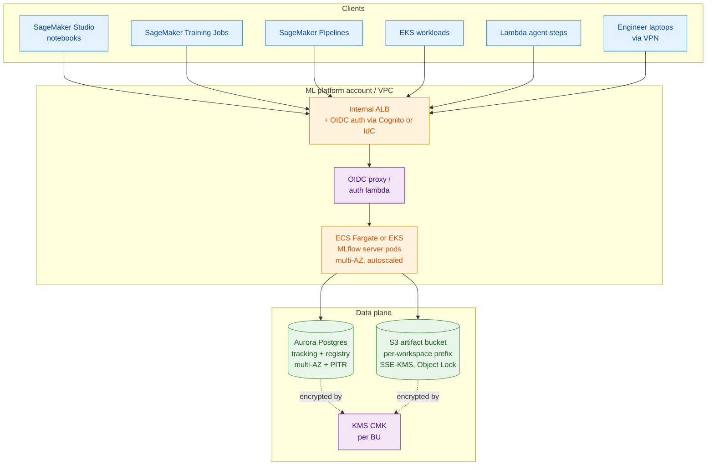
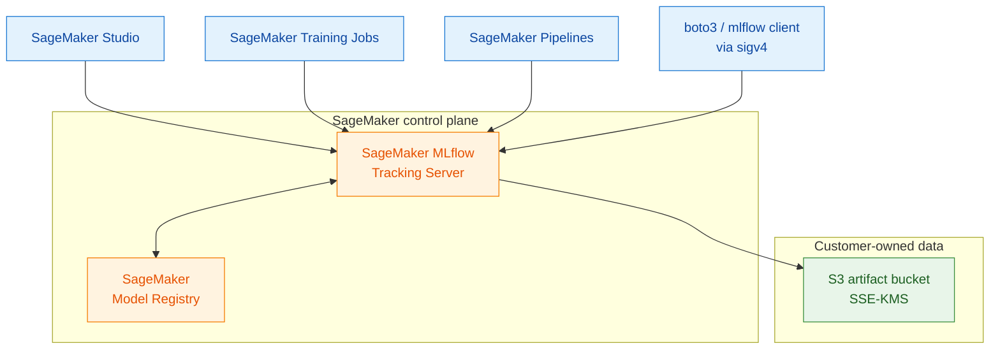
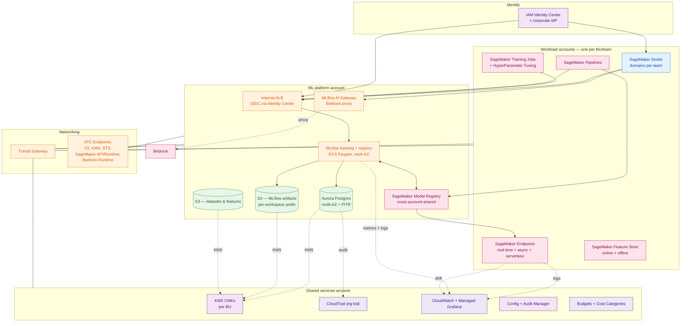
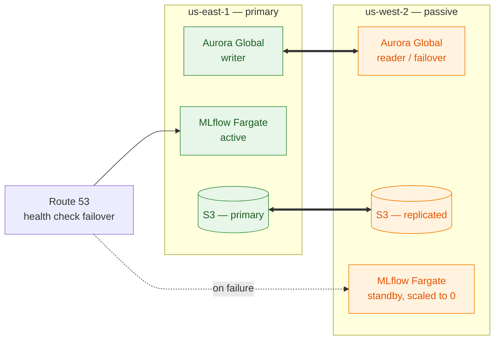
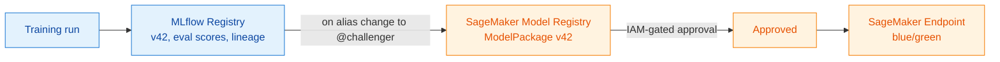

# 03 — MLflow on SageMaker — Deep Dive

This is the concrete architecture document. We assume the [layers from 01](01-platform-layers.html) and the [team mix from 02](02-team-personas-and-scenarios.html), and we draw the actual boxes and arrows for an MLflow-anchored ML platform on SageMaker.

We answer three questions:

1. **Where does MLflow run?** (Self-hosted vs SageMaker-managed.)
2. **How do training jobs, pipelines, and endpoints talk to it?**
3. **How does the platform isolate teams, encrypt data, and survive a region outage?**

## 1. The two deployment modes

There are exactly two ways to operate MLflow on AWS at scale, plus one anti-pattern.

### Mode A — Self-hosted MLflow on AWS

You run the MLflow tracking + registry server yourself on AWS compute, with your own database and S3 bucket.



**When to choose Mode A.**
- You need MLflow available in a region where SageMaker MLflow is not GA, or in GovCloud / China regions.
- You have multi-cloud or hybrid users who hit the same tracking server.
- You need fine-grained customisation: custom auth, custom plugins, custom artifact backends, custom retention.
- You operate at a scale where the per-MLflow-call AWS-managed price becomes meaningful.

**Cost shape.** Predictable: ALB + 2× Fargate tasks + db.r6g.large Aurora + S3 storage. ~$300–$1,500/mo for a single workspace at moderate volume; scales linearly.

**Operational burden.** Real but bounded: schema migrations on MLflow upgrades, backups, multi-region DR, on-call.

---

### Mode B — SageMaker-managed MLflow

AWS runs MLflow for you. You provision a `MLflow Tracking Server` resource via the SageMaker API; it is integrated with IAM, SageMaker Studio, and the SageMaker Model Registry.



**When to choose Mode B.**
- You want zero MLflow ops and you are happy inside the SageMaker control plane.
- You want IAM-native authn/authz with no extra OIDC layer.
- You want first-class integration with SageMaker Studio, Pipelines, Model Registry.
- Your users are predominantly SageMaker-first.

**Cost shape.** Per-tracking-server-hour + storage. Less predictable; can be more or less than Mode A depending on workload.

**Operational burden.** Near zero, at the cost of less control over upgrades and customisation.

**Constraints to check.**
- Region availability (limited compared to general SageMaker).
- Plugin / custom-store extensibility (more limited than self-hosted).
- Cross-region access patterns (an MLflow server is regional; multi-region needs replication you build).

---

### Anti-pattern — MLflow on a single EC2 with SQLite

We mention this only to name it. The "MLflow on a `t3.medium` with SQLite and a local artifact dir" pattern is fine for one engineer for a week. It is not a platform. Symptoms when it persists past that:

- Run history is single-tenant, can't be shared.
- Artifacts are on EBS and disappear when the instance dies.
- "Backup" means hoping the EBS snapshot worked.

Don't normalise it.

---

## 2. The decision: which mode for whom

The architecture council weighs in:

| Voice | Argument for Mode A (self-hosted) | Argument for Mode B (SageMaker MLflow) |
|---|---|---|
| **Platform tech lead** | Full control of upgrade cadence and plugin surface | Zero ops, faster onboarding |
| **SRE** | Predictable failure modes I understand | Fewer pages, AWS owns uptime |
| **Security & compliance** | Custom auth (OIDC + SCIM with our IdP) | IAM-native, simpler audit story |
| **ML researcher** | Don't care, as long as `mlflow.log_metric` works | Don't care |
| **FinOps** | Predictable line items | Variable cost, harder to forecast |

There is **no one right answer**. Most large orgs run *both*: a self-hosted MLflow as the central long-lived tracking + registry source of truth, and SageMaker MLflow as a *user-facing* tracking surface that syncs into the central registry. Where mode coexistence is needed, [09 — Decision framework](09-decision-framework.html) walks through the call.

---

## 3. The full reference architecture (single-region, multi-tenant, Mode A)

This is the picture we'd ship to a new BU on day one.



The picture looks busy because *the platform is busy*. Walk it slowly.

### 3.1 The accounts

Three account types — this is the smallest sane separation.

| Account | What lives here | Why separate |
|---|---|---|
| **Workload accounts** (one per BU or per team-cluster) | SageMaker Studio domains, training jobs, endpoints, feature stores | Blast radius, cost attribution, IAM simplicity |
| **ML platform account** | MLflow tracking server, AI Gateway, central S3 artifact bucket, central SageMaker Model Registry | The platform team owns this; no team can delete it accidentally |
| **Shared services account** | KMS keys, CloudTrail org trail, central observability, FinOps tooling | Compliance and finance own this |

Larger orgs split further: separate prod / non-prod accounts per BU, separate PCI-scoped accounts for Persona 4, separate GovCloud accounts.

### 3.2 The data plane

- **Aurora Postgres** holds MLflow's tracking + registry schema. Multi-AZ, PITR turned on, CMK-encrypted. Connection from MLflow via IAM database authentication where possible.
- **S3 artifact bucket** holds run artifacts. **Per-workspace prefixes**, with bucket policy that scopes IAM principals to their prefix. SSE-KMS with per-BU CMK. Object Lock on regulated workspaces. Lifecycle rules: hot for 90 days, IA for a year, Glacier afterwards.
- **S3 data bucket(s)** hold datasets and feature offline store; separate from artifacts to allow different lifecycle and access.

### 3.3 The control plane

- **Internal ALB** in front of MLflow, fronted by an OIDC layer (e.g. Cognito, ALB OIDC, or a small auth Lambda). Identity Center is the IdP.
- **MLflow on Fargate** (or EKS if you already run EKS at scale): two replicas minimum, behind the ALB. Stateless — all state is in Postgres + S3.
- **AI Gateway** (the [MLflow gateway](../concepts/gateway.html)) sits next to MLflow and proxies model calls (most usefully, Bedrock — see [04](04-mlflow-with-bedrock.html)).

### 3.4 The networking plane

- **Hub-and-spoke via Transit Gateway**: workload VPCs ↔ platform VPC ↔ shared services VPC.
- **VPC Interface Endpoints** for S3 (Gateway Endpoint), KMS, STS, SageMaker API, SageMaker Runtime, Bedrock Runtime. This keeps all traffic inside AWS's private network, makes egress controls coherent, and avoids NAT gateway fees for ML traffic.

### 3.5 The cross-account flow

A SageMaker Training Job in a workload account that wants to log to the platform account's MLflow:

1. The training job's execution role assumes a cross-account role in the platform account via STS.
2. That role is allowed to call the MLflow ALB and write to the workspace's S3 prefix.
3. The MLflow server records the run; the run's artifacts go to S3 under the workspace's prefix.
4. CloudTrail in the shared services account records the cross-account `AssumeRole`.

ABAC tags on both principal and resource keep the IAM policy small even with hundreds of teams.

---

## 4. Walking through the lifecycle

Concrete: a data scientist on Persona 1 (Recommendations) trains a new ranker. What happens?

```mermaid
sequenceDiagram
    autonumber
    participant DS as Data scientist
    participant ST as SageMaker Studio
    participant TJ as SageMaker Training Job
    participant MLF as MLflow tracking server
    participant S3 as S3 artifact bucket
    participant REG as MLflow + SM model registry
    participant PIPE as SageMaker Pipelines
    participant END as SageMaker endpoint

    DS->>ST: open notebook (SSO-authenticated)
    ST->>MLF: GET /experiments (sigv4 / OIDC)
    DS->>TJ: launch training (boto3 / sagemaker SDK)
    TJ->>MLF: start run, log params
    TJ->>S3: write checkpoints + model artifact
    TJ->>MLF: log metrics, log_artifacts(s3://...)
    TJ->>MLF: log_model() → registry
    MLF->>REG: register model version v42
    PIPE->>REG: read v42, run eval gate
    REG->>REG: transition v42 → @challenger
    PIPE->>END: deploy v42 as shadow endpoint
    END-->>PIPE: shadow metrics
    PIPE->>REG: promote v42 → @champion
    PIPE->>END: shift production traffic to v42
```

A few details that matter:

- **Step 5** (`log_artifacts`) does not stream artifacts through MLflow; the client uploads directly to S3 and only the *URI* goes through MLflow. This is why the artifact store IAM policy is on the *client*, not the MLflow server.
- **Step 8** (`log_model`) is where MLflow's [models-and-flavors](../concepts/models-and-flavors.html) abstraction earns its keep — the model is packaged with its environment, signature, and flavor metadata so any downstream consumer can load it without knowing which framework trained it.
- **Step 13** (transition) is governed by an *eval gate* in the pipeline, not a human. Humans are involved in setting up the gate, not in clicking through every promotion.

---

## 5. Multi-region

Two patterns. Pick by who your users are.

### Active-passive (most common)

Primary region runs MLflow + Aurora + S3. Secondary region has Aurora replica (Aurora Global Database), S3 cross-region replication for artifacts, and MLflow server pods running but unused. DNS failover via Route 53.



RPO seconds, RTO minutes. Sufficient for almost every team except real-time inference (which has its own multi-region story at the endpoint layer, not the MLflow layer).

### Active-active per region

Each region has its own MLflow + Aurora + S3, with no global writer. Cross-region search is done by federating queries from a thin "global view" service. Best when you actually have users in multiple regions whose latency to a shared MLflow would be unacceptable, or when sovereignty (an EU MLflow that legally cannot replicate to US) requires it.

This is more complex. Don't pick it unless a constraint forces it.

---

## 6. Networking & IAM in detail

### Network policy summary

| Source | Destination | How |
|---|---|---|
| SageMaker job → S3 | Same region | S3 Gateway Endpoint (free) |
| SageMaker job → MLflow ALB | Cross-account, same region | Transit Gateway + private ALB |
| SageMaker job → Bedrock | Same region | Bedrock Runtime VPC Endpoint |
| Engineer laptop → MLflow UI | Office or VPN | Internal ALB via VPN; never public |
| MLflow → Aurora | Same VPC | Security group only |
| Cross-region Aurora replication | Different region | AWS-managed, encrypted |

### IAM policy patterns (ABAC)

Tag every workload principal with `team=<name>` and tag every resource with `team=<name>`. The policy says *"the principal can act on the resource if its team tag matches."* This is one policy that scales to thousands of teams.

```jsonc
{
  "Effect": "Allow",
  "Action": ["s3:GetObject", "s3:PutObject"],
  "Resource": "arn:aws:s3:::ml-artifacts-platform/${aws:PrincipalTag/team}/*"
}
```

The MLflow tracking server itself runs under a tightly-scoped role: it can read/write its Aurora schema and read/write the artifact bucket only via *signed URLs* it generates for clients. Clients never present the MLflow server's credentials.

### KMS key strategy

- One CMK per BU, used for both Aurora and the artifact prefix that BU owns.
- Cross-account access via key policy + IAM grant, not by sharing secrets.
- Rotation enabled.
- Separate CMK for the SageMaker training job filesystem encryption if you have FSx / EBS.

This is the same pattern AWS itself recommends in their Well-Architected ML Lens; we are not inventing it.

---

## 7. SageMaker Model Registry vs MLflow Model Registry

A near-universal question. The honest answer:

| | MLflow Registry | SageMaker Model Registry |
|---|---|---|
| **Granularity** | Per-version with tags + aliases | Per-`ModelPackage` in `ModelPackageGroup` |
| **Native UI** | MLflow UI (familiar to data scientists) | SageMaker console (familiar to MLOps) |
| **Approval workflow** | Manual or via MLflow webhooks/API | **Native, IAM-policied approval** |
| **Deployment** | Via plugins (e.g. `mlflow.sagemaker`) | **Native to SageMaker Endpoints** |
| **Cross-account sharing** | Build it yourself | **Native via Resource Access Manager** |

**Recommended pattern.** Treat MLflow Registry as the *source of truth for what models exist and how they performed*, and treat SageMaker Model Registry as the *deployment-side mirror that drives endpoint creation and approval gates*. Sync from MLflow → SageMaker on registry transition, not the other way around. The SageMaker MLflow managed offering does this synchronisation for you.



---

## 8. Cost shape (rough order of magnitude)

For a single BU running ~50 active data scientists, ~200 training jobs/day, 5 production endpoints:

| Item | Order of magnitude | Notes |
|---|---|---|
| MLflow ECS + ALB | $200/mo | Two Fargate tasks, internal ALB |
| Aurora Postgres (db.r6g.large, MAZ) | $400–$800/mo | Doubles for multi-region |
| S3 artifacts | $50–$500/mo | Strongly depends on retention policy |
| KMS, CloudTrail, Config | $50/mo | Almost noise |
| **MLflow platform fixed cost** | **~$1k/mo** | Per BU per region |
| SageMaker Studio user time | $$$$ | Dominates total spend |
| Training jobs | $$$$ | Dominates total spend |
| Endpoints | $$$ | Reduces with serverless / inference components |

Translation: the MLflow platform itself is rounding error compared to the SageMaker compute it tracks. The right thing to optimise for is *not the platform's cost* but *the platform's effect on compute cost*. A platform that reduces idle endpoint cost by 20% pays for itself many times over.

---

## 9. The shortlist of mistakes we keep seeing

1. **One MLflow for the whole company.** Single failure domain, single migration window, single noisy-neighbour victim.
2. **Tracking server on a public ALB with shared password auth.** Audit trail does not survive contact with security review.
3. **No retention policy.** Aurora at 1 TB, S3 with millions of tiny artifacts. Restore-from-backup takes a weekend.
4. **Artifacts uploaded through MLflow rather than directly to S3.** Tracking server becomes a bottleneck and a hotspot.
5. **Same KMS key for everything.** Defeats most of the point of CMKs.
6. **Manual deployments from registry.** Lineage chain from run → registry → endpoint is broken.
7. **No paved-road Studio image.** Every team installs their own MLflow client version, with their own bugs.
8. **Treating MLflow as "the platform."** It is the connective tissue. The platform is the twelve layers in [01](01-platform-layers.html).

Continue with [MLflow with Bedrock — deep dive →](04-mlflow-with-bedrock.html).
