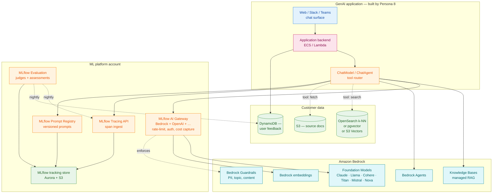
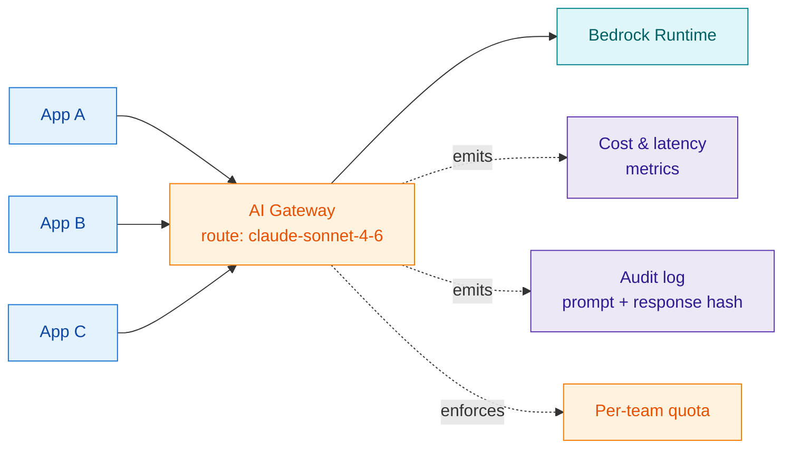
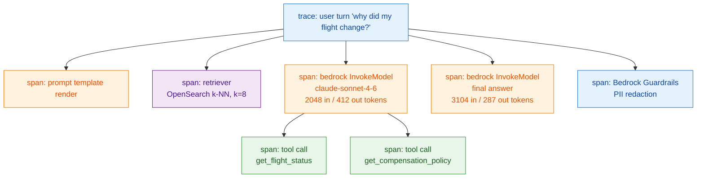
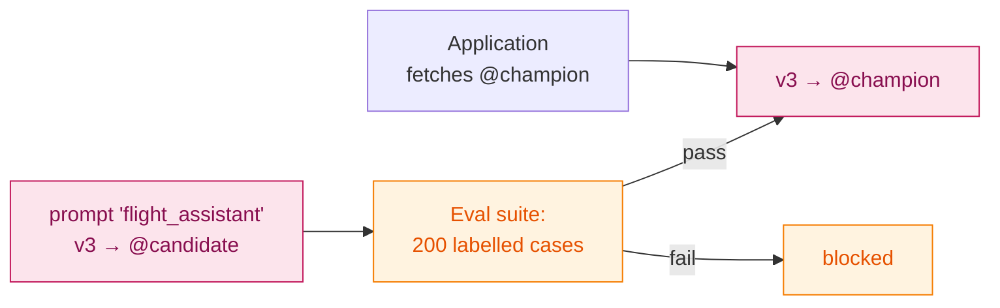
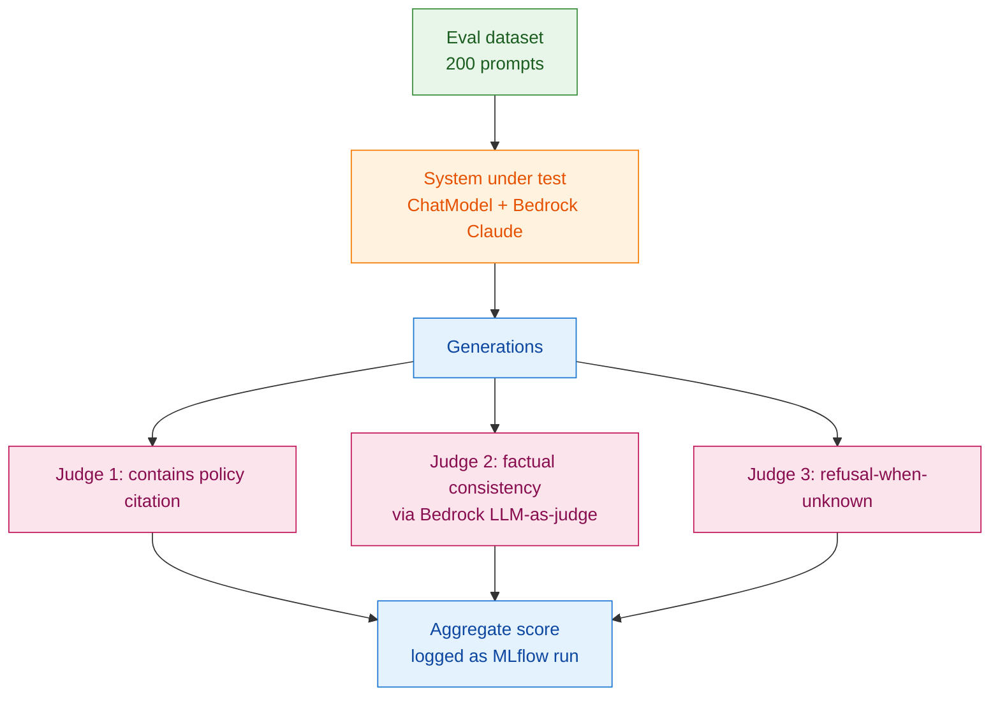
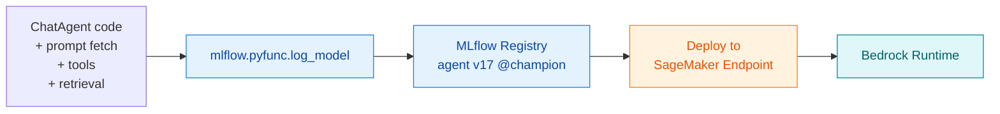
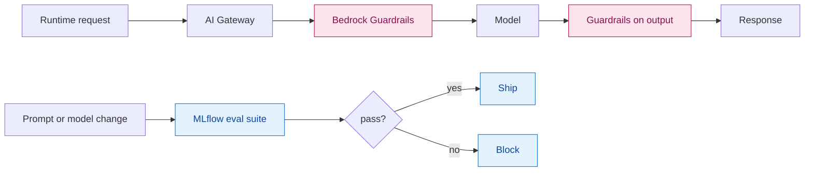

# 04 — MLflow with Bedrock — Deep Dive

The classical ML platform from [03 — MLflow on SageMaker](03-mlflow-on-sagemaker.html) optimises for *training and deploying models you own*. The GenAI platform optimises for something different: *composing, prompting, evaluating, and observing models you call*. The substrate on AWS is **Bedrock**; the connective tissue is **MLflow's tracing, prompt registry, evaluation, gateway, and ChatModel runtime** (see the [AI platform map](../ai-platform.html) and the per-concept docs under [`concepts/`](../concepts/tracing.html)).

This document draws the reference architecture for the GenAI side and shows how each MLflow surface maps to a Bedrock capability.

## 1. The shape of a GenAI workload (vs classical ML)

Classical ML and GenAI on Bedrock differ in the *axis of work*.

| Axis | Classical ML | GenAI on Bedrock |
|---|---|---|
| **Cost driver** | Training compute | **Inference tokens** |
| **Iteration unit** | A run (data + code + model) | **A prompt + a model + tools + a guardrail** |
| **"The model"** | An artifact you produce | A foundation model you don't own + your wrapper |
| **Quality signal** | Offline metric vs labels | **Eval suites + judge LLMs + user signals** |
| **Failure mode** | Drift in input distribution | **Hallucination, toxicity, jailbreak, leakage** |
| **Observability unit** | Predictions + drift metrics | **Span trees: prompt, retrieval, tool calls, completion** |

This shift is why MLflow's GenAI surfaces — tracing, prompt registry, evaluation, gateway — exist alongside the classical ones. They are not optional addenda; they are the GenAI substrate.

## 2. The reference architecture



The picture has more boxes than the classical one because GenAI has more layers of *compose*. We walk it surface by surface.

---

## 3. Surface 1 — Bedrock as a model backend

Bedrock is *just* the inference layer. From the platform's perspective, it offers:

| Capability | Bedrock service | Used by |
|---|---|---|
| Foundation model inference | InvokeModel / Converse / streaming | Every GenAI app |
| Embedding generation | Titan Embeddings, Cohere Embed via Bedrock | RAG retrieval |
| Managed RAG | Bedrock Knowledge Bases | Apps that don't want to own retrieval |
| Agent runtime | Bedrock Agents (tool use, orchestrator) | Apps that use Bedrock-native tool plumbing |
| Safety | Bedrock Guardrails | Every external-facing app |
| Customisation | Fine-tuning, Custom Model Import, Continued Pre-training | Persona 9 (FM fine-tuning) |
| Capacity | On-demand vs Provisioned Throughput | Apps with predictable high volume |

**Architectural choice — Bedrock vs self-hosted FMs.** Bedrock should be the default. Self-hosting an FM on SageMaker Endpoints with `g6e`/`p5` instances is *cheaper per token at extremely high volume* and gives you total isolation, but it imposes:

- Capacity planning for GPUs.
- Patch management (vulnerabilities in inference servers).
- Your own scaling, observability, multi-region story.
- Often, slower model upgrades than Bedrock's catalog.

Pick self-host only when a constraint *forces it* — extreme volume, model-not-on-Bedrock, or sovereignty (air-gapped/region not served).

---

## 4. Surface 2 — MLflow AI Gateway in front of Bedrock

The [AI Gateway](../concepts/gateway.html) is MLflow's unified façade in front of LLM providers. With Bedrock as a route, every Bedrock call from your apps goes through one place.



What you get for free by going through the Gateway:

1. **Provider abstraction.** Switch a route from Bedrock-Claude to Bedrock-Llama (or to a non-Bedrock provider) by editing config; apps don't change.
2. **Per-team auth and quotas.** API keys / IAM-scoped tokens per consuming app. Stop one team from burning the company's Bedrock quota.
3. **Cost capture.** Every call has a cost; Gateway records it and tags it. This is the difference between "we spent $1M on Bedrock" and "team X spent $400k on Bedrock for product Y."
4. **Audit trail.** Hash of prompt + response, tagged with caller. Real value during a security incident.
5. **One enforcement point for guardrails.** Gateway can call Bedrock Guardrails for every request, regardless of whether the app remembered to.

**Anti-pattern:** apps calling `boto3.client("bedrock-runtime")` directly. You lose every benefit above. Make Gateway the paved road and require it via egress allow-list (Bedrock Runtime VPC Endpoint reachable only from the Gateway's security group).

---

## 5. Surface 3 — MLflow Tracing on Bedrock calls

The single most underrated MLflow GenAI feature. Auto-tracing instruments common SDKs so every model call, retrieval, and tool invocation becomes a span (see [tracing](../concepts/tracing.html), [auto-tracing](../concepts/auto-tracing.html)). With Bedrock + LangChain / LlamaIndex / DSPy / OpenAI SDK, you typically need exactly two lines:

```python
import mlflow
mlflow.<integration>.autolog()
```

A single user turn produces a tree like:



What this gives you:

- **Debugging.** Why did the bot say that? Open the trace, see the retrieved documents, the tool outputs, the exact prompt sent to Claude.
- **Cost attribution per turn.** Sum of token counts across spans → dollar cost of this conversation.
- **Latency attribution.** Which span dominated the p99? Usually retrieval or the second LLM call.
- **Eval substrate.** Evaluation runs (next surface) operate over traces.

**Storage.** Traces go through MLflow into Postgres + S3 like other artifacts. At GenAI app volume, the *trace volume is large*. Tier:

| Tier | Where | Retention | Why |
|---|---|---|---|
| Hot | Aurora + S3 (live) | 30 days | UI browsing, recent debugging |
| Warm | S3 Parquet via Athena | 90 days | Eval runs, weekly drift analysis |
| Cold | S3 Glacier | 1+ year (compliance) | Audit, incident replay |

Sampling is fair game for high-QPS production paths. 100% sampling is fine for internal copilots; 1–10% is more typical for consumer apps.

---

## 6. Surface 4 — MLflow Prompt Registry

Prompts behave like code: they have versions, owners, tests, deployments. Treating them like config files in a repo gets you 30% of the way; an actual registry gets you the rest.



What MLflow's prompt registry adds over "prompts in git":

- **Runtime fetch by alias.** Apps fetch `prompt:flight_assistant@champion`, not a hard-coded string. Promote a new version with no app deploy.
- **Variables and templating** as first-class.
- **Lineage** — a trace records *which prompt version generated it*, so you can answer "is this hallucination from the new prompt or the new model?"
- **Approval gates** before promotion.

**Pattern: prompt + model are one unit.** Treat the pair as the deployable. Promoting a new prompt against the old model is a deployment. Switching models with the same prompt is a deployment. Both go through the same eval gate.

---

## 7. Surface 5 — MLflow GenAI Evaluation

[GenAI evaluation](../concepts/genai-evaluation.html) is how you decide whether a prompt+model+tool combination is *better than the previous one*. The shape:

1. Curated dataset of inputs (with optional reference outputs).
2. The system under test — typically your `ChatModel` wrapper.
3. **Judges**: programmatic checks (regex, contains, schema-valid) and **LLM-as-judge** (often Claude on Bedrock judging another Bedrock model's output).
4. **Assessments** attached to each generation.
5. An evaluation run, stored in MLflow, comparable across model/prompt versions.



**The Bedrock connection.** Two of your judges are usually *also* Bedrock models — typically Claude Opus or Sonnet judging output from a cheaper model. This makes Bedrock both the system under test and the evaluation oracle. The cost trap is real: an eval run on 200 cases with 3 LLM judges = ~600 extra Bedrock calls. Budget for it.

**Cadence.**
- **Pre-merge:** every prompt or model change runs the eval suite as a CI gate.
- **Nightly:** broader suites against production traffic samples.
- **Post-incident:** the trace from an incident is added to the eval dataset, so the bug never reappears silently.

---

## 8. Surface 6 — ChatModel / ChatAgent runtime

The [ChatModel + agent runtime](../concepts/chatmodel-agents.html) is MLflow's typed pyfunc for chat-style models. Why it matters in the Bedrock world:

- **A single deployable artifact** that wraps a Bedrock call + retrieval + tools + post-processing. The artifact is an MLflow model in the registry.
- **Loaded by the scoring server**, served behind SageMaker Endpoints, ECS, Fargate, or Lambda. Same artifact runs anywhere `pyfunc` runs.
- **Automatically traced.** Every invocation is a trace tree; you don't write tracing code.
- **Versioned in the registry.** `agent:flight_bot@champion` is the unit you promote.

This solves the *"how do I deploy a thing that is more than a single LLM call"* problem. Without it, every team builds their own Lambda-or-Fargate "agent service" with their own logging, their own version scheme, their own deployment story.



---

## 9. RAG architectures: the four patterns

For Persona 8, RAG is most of the work. There are four AWS-native patterns; pick by team capability and constraints.

| Pattern | Retrieval | Orchestration | Owns prompt | Owns trace |
|---|---|---|---|---|
| **(A) DIY RAG** | OpenSearch k-NN / pgvector | Your `ChatModel` | You (MLflow Prompt Registry) | You (MLflow Tracing) |
| **(B) Bedrock Knowledge Bases** | Managed by Bedrock | Your `ChatModel` calls KB | KB-managed (limited control) | You (MLflow Tracing on the wrapper) |
| **(C) Bedrock Agents + KB** | Managed | Bedrock Agent runtime | Bedrock Agent config | Bedrock + you |
| **(D) Bedrock Agents + custom tools** | Custom | Bedrock Agent calls Lambda tools | Bedrock Agent config | Bedrock + you |

```mermaid
flowchart TB
    classDef a fill:#e3f2fd,stroke:#1976d2,color:#0d47a1;
    classDef b fill:#fff3e0,stroke:#f57c00,color:#e65100;
    classDef c fill:#e8f5e9,stroke:#388e3c,color:#1b5e20;
    classDef d fill:#fce4ec,stroke:#c2185b,color:#880e4f;

    subgraph PA[A — DIY]
        A1[OpenSearch] --> A2[ChatModel] --> A3[Bedrock]
    end:::a

    subgraph PB[B — Bedrock KB + your wrapper]
        B1[Bedrock KB] --> B2[ChatModel] --> B3[Bedrock]
    end:::b

    subgraph PC[C — Bedrock Agent + KB]
        C1[Bedrock Agent] --> C2[Bedrock KB]
        C1 --> C3[Bedrock]
    end:::c

    subgraph PD[D — Bedrock Agent + custom tools]
        D1[Bedrock Agent] --> D2[Lambda tools]
        D1 --> D3[Bedrock]
    end:::d
```

**Choosing.**
- **A — DIY RAG** for teams that want full control and have the maturity to operate retrieval. Best MLflow fit (everything is yours to instrument).
- **B — Bedrock KB + wrapper** for teams that want to skip retrieval ops. Still own the orchestration, so MLflow tracing covers the wrapper.
- **C/D — Bedrock Agents** when you specifically want Bedrock's agent runtime (built-in tool plumbing, native console). Tradeoff: less of the trace tree is yours; Bedrock owns the inner orchestration. You get back partial visibility via Bedrock's own observability + your wrapping spans.

> **Architecture council moment.** *Researcher* prefers A (full control). *Platform tech lead* prefers B (less platform surface). *FinOps* notes C and D have hidden cost in agent steps. *Security* prefers anything where Guardrails are enforced at the gateway, not relied on per-team. The pragmatic default for most teams is **B**.

---

## 10. Safety: Bedrock Guardrails + MLflow evaluation

Two complementary mechanisms.

| Mechanism | Where it runs | What it catches |
|---|---|---|
| **Bedrock Guardrails** | At Bedrock call time | PII, banned topics, content categories, prompt-injection patterns; can redact, block, or modify |
| **MLflow eval judges** | Pre-merge / nightly / on-trace | Subtler issues: factual inconsistency, hallucination rate, refusal failures, bias |

Bedrock Guardrails is your *runtime* safety. MLflow evaluation is your *change-management* safety. You need both.



---

## 11. Multi-region for GenAI

GenAI multi-region differs from classical ML multi-region.

- **Bedrock is regional.** A model available in `us-east-1` may not be in `eu-west-1` on the same day. Multi-region apps must select the model+region pair carefully.
- **Cross-region inference (Bedrock CRIS)** lets a single API call route across regions for capacity. Useful for resilience; counts against quotas in any region used.
- **Knowledge Bases and Agents are regional.** Replication is your problem.
- **MLflow tracking is regional.** A multi-region app should write traces to its local region's MLflow and aggregate offline (S3 cross-region replication of trace exports + central Athena view).

> **Sovereignty caveat.** EU-only or GovCloud workloads must pin everything — Bedrock model selection, KB region, MLflow region, S3 bucket region. Mismatches usually surface as compliance violations, not errors.

---

## 12. Cost shape and the levers that matter

GenAI cost is dominated by **tokens × QPS × model price**. The levers, ranked by typical impact:

1. **Right-size the model.** Sonnet for the bulk, Opus for the hard cases routed via a small classifier. Often 5–20× savings on a real workload.
2. **Cache.** Bedrock prompt caching for system prompts and long context. MLflow Tracing can prove cache hit rates per app.
3. **Compress retrieval context.** Long context = many input tokens. Rerank + summarise before the final LLM call.
4. **Provisioned Throughput** if you have predictable high QPS on a single model. Reserves capacity at a fixed monthly price; sometimes cheaper than on-demand.
5. **Batch eval cadence.** Don't run a 600-call eval suite per CI commit; run smoke tests per commit and full suites nightly.
6. **Trace sampling** at high QPS.

**FinOps hook.** AI Gateway tags every call with `team`, `app`, `model`, `route`. CUR + Athena turns that into a $-per-team-per-app dashboard. Without it, Bedrock spend is a single line item growing every month with no leverage.

---

## 13. The shortlist of mistakes we keep seeing

1. **Apps calling Bedrock directly, bypassing Gateway.** No cost attribution, no quotas, no audit, no enforced Guardrails.
2. **No prompt registry.** Prompts in code → impossible to A/B, impossible to roll back without a deploy.
3. **No eval suite.** Quality is "did the demo work."
4. **Tracing turned off "to save cost."** Saves a few percent of cost; loses 100% of GenAI debuggability.
5. **One Bedrock model for everything.** Pays Opus prices for tasks Haiku could do.
6. **Guardrails configured per-app inconsistently.** Compliance review finds five apps with five different policies.
7. **Eval judges that are also the system under test.** Self-grading. Use a different model, ideally a different family, as judge.
8. **Treating Bedrock Agents and ChatModel as competitors.** They compose: Bedrock Agent for orchestration where it fits, ChatModel as the registered/served unit where it doesn't.

---

## 14. How this connects back to MLflow on SageMaker

The classical platform from [03](03-mlflow-on-sagemaker.html) and the GenAI platform here share:

- The same MLflow tracking server, Aurora, S3.
- The same identity, networking, KMS.
- The same model registry concept (with prompts and ChatAgents as additional entries).
- The same observability backbone (CloudWatch + MLflow + Grafana).
- The same FinOps machinery (tags, CUR, dashboards).

What differs is the *substrate* (SageMaker compute vs Bedrock APIs) and the *unit of iteration* (run+model vs prompt+model+tools+guardrail). The platform team's job is to keep the shared foundation actually shared, so a team moving from classical ML to GenAI doesn't re-learn identity, networking, or governance from scratch.

Continue with [Constraints → architecture matrix →](05-constraints-impact-matrix.html).
