# 05 — Constraints → Architecture Matrix

The previous documents introduced the [layers](01-platform-layers.html) and [personas](02-team-personas-and-scenarios.html). This one is the working tool: **when a constraint changes, what moves?**

The pattern we keep seeing is that teams argue about layer 9 (inference) when the constraint actually moves layer 1 (identity), layer 3 (storage), and layer 11 (governance). This document is structured to make that visible.

## How to read this document

For each constraint dimension we:

1. State the dimension and the typical *baseline* assumption.
2. Show the matrix: which layers move, and how, as the constraint tightens.
3. Surface the architectural debate (which voice on the [council](00-architectural-thinking.html#3-the-architecture-council--five-voices-one-decision) wins).
4. Call out the irreversible decisions that the constraint locks in.

We treat eight constraint dimensions:

| # | Constraint | Spectrum |
|---|---|---|
| A | Scale (users / models / requests) | 10 → 100 → 1,000 → 10,000+ |
| B | Latency | minutes (batch) → seconds → < 100 ms |
| C | Regulatory regime | none → SOC 2 → HIPAA / PCI → SR 11-7 |
| D | Data sovereignty | global → regional → national → air-gapped |
| E | Tenant isolation | shared → workspaces → accounts → physically separate |
| F | Team autonomy | central paved road → federated golden paths → free-for-all |
| G | Cost envelope | "spend what's needed" → tight per-team budgets → unit-economics-driven |
| H | Reliability target | 99.0% → 99.9% → 99.99% |

---

## Dimension A — Scale

Baseline: 50 data scientists, 10 active models, 1 region.

| Layer | 50 users | 500 users | 5,000 users | 50,000 users |
|---|---|---|---|---|
| **1. Identity** | One IAM Identity Center, RBAC ok | ABAC, group-based | ABAC + automated provisioning | Federated identity per BU, account factory |
| **2. Networking** | One VPC | Hub-and-spoke per env | Hub-and-spoke per region | Multi-region transit, dedicated network team |
| **3. Storage** | One S3 bucket, one Aurora | Per-team prefixes | Per-BU buckets + Aurora | Per-BU regions; lifecycle automation |
| **4. Compute** | Studio + on-demand training | Spot + autoscaling | Capacity Reservations + HyperPod for big runs | Capacity team, Capacity Blocks calendar |
| **5. MLflow tracking** | One server | One per BU | One per BU per region | Plus a central federated search layer |
| **7. Registry** | MLflow only | MLflow + SM Model Registry sync | Multi-account share via RAM | Cross-region replication |
| **8. Orchestration** | Pipelines or Step Functions, ad hoc | Templates per BU | Self-serve template catalog | Tier-1 paved road + tier-2 escape hatch |
| **9. Inference** | Single endpoints | MME / Inference Components | Multi-region endpoints | Edge tier + cell-based architecture |
| **10. Observability** | CloudWatch | CW + Grafana | CW + Grafana + Managed Prometheus + custom dashboards | Dedicated observability platform team |
| **11. Governance** | Manual reviews | Templated approval workflows | Automated evidence collection | Continuous compliance posture |
| **12. FinOps** | Monthly Cost Explorer | Tag policies + per-team budgets | CUR → Athena → per-app dashboards | Showback, then chargeback, with quotas |

**The phase change is at ~500 users.** Below that, one team can run the platform on weekends. Above that, the platform is a product with on-call.

**The second phase change is at ~5,000 users / multi-region.** Below that, you can have one tracking server. Above that, you cannot — the failure domain is too large.

**Council debate.**
- *Researcher:* "I just want one place to search across all runs." (Argues against per-BU split.)
- *SRE:* "Then your one place is also your single point of failure." (Argues for per-BU split.)
- Resolution: per-BU stores, plus a thin global *search index* (read-only) that federates queries. Best of both.

**Irreversible at this dimension.** The choice of one MLflow vs many. Once you've split, merging is a year-long migration. Do this deliberately, with your eyes open to the multi-region future.

---

## Dimension B — Latency

Baseline: batch inference, hours of acceptable latency.

| Layer | Batch (hours) | Near-real-time (seconds) | Real-time (< 100 ms) | Hard real-time (< 10 ms) |
|---|---|---|---|---|
| **3. Storage** | S3 fine | Online feature store needed (DynamoDB) | DynamoDB + ElastiCache | In-process cache + warm shards |
| **4. Compute** | SageMaker Processing / AWS Batch | SageMaker Async Inference | SageMaker Real-Time Endpoints, GPU/Inferentia | Custom on EC2 / Inferentia, kernel-tuned |
| **6. Feature store** | Offline only | Online required | Online + ms-budget reads | Often inlined; feature store removed from hot path |
| **9. Inference** | Batch Transform | Async Inference / serverless | Real-Time Endpoints + autoscaling | Inference Components, multi-AZ, pre-warmed |
| **10. Observability** | Daily reports | Per-minute drift | Per-second metrics, p99/p999 SLO | Per-request tracing, instrumented at every hop |
| **11. Governance** | Async approvals fine | Promotion automated | Promotion automated + canary | Promotion automated + shadow + canary + auto-rollback |

**What does *not* change much.** MLflow tracking. The training side is independent of inference latency (mostly). What does change is the *deployment artifact* — for hard real-time, the model often gets re-packaged (ONNX, TensorRT, Inferentia compilation) and the registry stores both the source MLflow model and the optimised binary as separate artifacts.

**Council debate.**
- *Researcher:* "Just train and ship." 
- *SRE:* "If we autoscale on RPS we'll cold-start under burst." Pre-warm. Provisioned concurrency. Capacity headroom.
- *FinOps:* "Pre-warming costs real money." Headroom is a knob; pick the SLO and pay for the headroom that meets it. Stop arguing about the knob and price both options.

**Irreversible at this dimension.** Choosing the inference packaging format. ONNX/Inferentia compilation paths affect the registry, the Docker image, the autoscaling shape, and the rollback story. Don't add or remove this lightly.

---

## Dimension C — Regulatory regime

Baseline: internal-only, light SOC 2 posture.

| Layer | None | SOC 2 | HIPAA / PCI | SR 11-7 / banking |
|---|---|---|---|---|
| **1. Identity** | RBAC | RBAC + access reviews | ABAC + JIT access + break-glass | Independent validation team has separate identity |
| **2. Networking** | Public ALBs ok internally | Private ALBs, VPC endpoints | Egress allow-list, no internet egress | Air-gapped option, dedicated DX |
| **3. Storage** | SSE-S3 fine | SSE-KMS, CMK | CMK with key-policy isolation; **Object Lock** on regulated artifacts | + WORM, off-site backup, retention enforced by policy |
| **4. Compute** | Any | VPC-isolated | VPC + KMS-encrypted volumes + image scanning | Service Catalog products only, no ad hoc launches |
| **5. MLflow** | Default install | Audit logs to CloudTrail | Hardened image; auth via IdP only; immutable run history | Run history + registry transitions are a regulatory record |
| **7. Registry** | Free promotion | Promotion logged | Promotion requires evidence (eval, fairness, owner) | + Independent validation sign-off, 7-year retention |
| **9. Inference** | Anywhere | Endpoints in private subnets | Endpoints behind WAF, scoped IAM | + change-control gate on every deploy, no canaries without approval |
| **10. Observability** | CW logs | CW + 1-year retention | CW + 7-year cold archive, query audit | + Independent validator has read access |
| **11. Governance** | Periodic reviews | Quarterly access review | Continuous evidence (Config, Audit Manager) | Continuous + dedicated MRM team, model risk inventory |
| **12. FinOps** | Tags helpful | Tags required | Tag policies enforced at provisioning | + cost-of-control tracked separately |

**The big shift at HIPAA/PCI.** Identity, networking, storage, governance all move at once — you cannot bolt one on later. This is the single most important reason to set up the *general-purpose paved road* with separation in mind, even if you don't need HIPAA today: it's much cheaper to *not use* a separation you have than to retrofit one you don't.

**The big shift at SR 11-7.** Process, not technology, dominates. The registry becomes a regulatory record. *Bedrock is often out of scope* until provenance and explainability stories satisfy the validators.

**Council debate.**
- *Security:* "Lock everything down by default."
- *Researcher:* "Then nothing ships."
- Resolution: paved-road tiers. Tier 0 (research, internal data only). Tier 1 (general production). Tier 2 (regulated). Each tier has its own paved road; teams pick by data classification.

**Irreversible at this dimension.** Account topology and KMS strategy. Migrating a workload from a non-regulated to a regulated account is months of work. Provision the regulated account *empty* on day one.

---

## Dimension D — Data sovereignty

Baseline: data and compute in one region.

| Layer | Single region | Regional (e.g. EU + US) | National (China, GovCloud) | Air-gapped |
|---|---|---|---|---|
| **1. Identity** | One IdP tenant | Per-region IdP federation | Country-specific IdP, no cross-border auth | Local-only IdP |
| **2. Networking** | One VPC | Region-isolated VPCs, no cross-region peering for data | DX in-country only, separate AWS partitions | No external connectivity |
| **3. Storage** | One bucket | Per-region buckets, no replication of regulated data | Per-partition (`aws-cn`, `aws-us-gov`) | On-prem object store |
| **4. Compute** | Any region | Pinned per region | Partition-specific instance types, capacity | On-prem compute |
| **5. MLflow** | One server | Per region, optional federated read | Per partition, no federation | On-prem install |
| **9. Inference + Bedrock** | Bedrock anywhere | **Per-region model availability matters** | **Bedrock unavailable in some partitions** | Self-hosted FMs only |
| **10. Observability** | Central | Per region | Per partition | Local |
| **11. Governance** | Standard | Per-region evidence | Per-jurisdiction evidence | Manual |

**The defining issue is Bedrock.** Bedrock's region and partition coverage shapes the architecture more than any other single fact. Workloads in regions where Bedrock is unavailable must self-host FMs on SageMaker or EKS, accept slower model upgrades, and own their own safety layer.

**Council debate.**
- *Compliance:* "EU data must not leave the EU."
- *Researcher:* "I want one global view of all my experiments."
- Resolution: per-region MLflow, with a *metadata-only* federation (run names, dates, owners, tags) and *no artifact* federation. The global view is "what experiments exist where," not "give me the artifact."

**Irreversible at this dimension.** Where you put data in the first place. Once data is in `eu-central-1`, moving it costs months and lawyer hours. Decide at ingest.

---

## Dimension E — Tenant isolation

Baseline: a few teams sharing accounts and stores.

| Layer | Shared account, shared workspace | Shared account, per-team workspace | Per-team account | Per-tenant physically separate |
|---|---|---|---|---|
| **1. Identity** | RBAC | Workspace-level ABAC | Account-level role assumption | Separate IdPs |
| **2. Networking** | One VPC | Same VPC, security groups per team | One VPC per account | Dedicated VPC + DX per tenant |
| **3. Storage** | Shared bucket, prefixes | Per-workspace prefix, IAM-enforced | Per-account bucket | Dedicated bucket + KMS |
| **5. MLflow** | Single workspace | **Workspace-aware tracking store** (this fork's workspace plumbing) | Per-account MLflow or shared with account ID in workspace | Dedicated MLflow |
| **9. Inference** | Shared endpoints possible | Per-team endpoints | Per-account endpoints | Dedicated capacity |
| **11. Governance** | Hard | Workspace-scoped evidence | Account-scoped (clean) | Per-tenant audit |
| **12. FinOps** | Tag-based attribution (lossy) | Workspace + tag attribution | **Native account-level cost** | Per-tenant invoice |

**Why MLflow's workspace plumbing matters.** This fork's `tests/store/tracking/test_sqlalchemy_store_workspace.py` and the workspace-aware paths called out in `CLAUDE.md` exist precisely so a single MLflow server can host multiple workspaces with strict per-workspace isolation. That capability lets you sit at the *middle* of the spectrum — many teams sharing infra cost-effectively without giving up tenant isolation in the metadata model.

**Council debate.**
- *FinOps:* "Account-per-team gives me clean cost." (Strong argument.)
- *Platform tech lead:* "Account-per-team gives me 200 accounts to upgrade." (Equally strong.)
- Resolution: account-per-BU (5–20 accounts), workspace-per-team within (hundreds of workspaces). Cost lives at the account boundary; metadata isolation lives at the workspace boundary.

**Irreversible at this dimension.** The account topology is essentially permanent. Decide it once, with org-wide buy-in.

---

## Dimension F — Team autonomy

Baseline: a central platform team owns the paved road.

| Layer | Central paved road | Federated paved roads | Free-for-all |
|---|---|---|---|
| **4. Compute** | Studio image, training templates, image catalog | BUs can extend templates | Anything goes |
| **5. MLflow** | One blessed client version, one tracking server | BUs run their own MLflow, federate read | Whatever each team installs |
| **8. Orchestration** | Pipelines templates | Multiple orchestrators tolerated | Each team picks |
| **9. Inference** | One deploy plugin | Multiple deploy patterns | Each team builds Docker |
| **11. Governance** | Easy: one place to check | Per-BU evidence | Manual every time |
| **12. FinOps** | Standard tags enforced | Per-BU tag schemas | Tag chaos |

**The myth of "more autonomy = more velocity."** Up to a point, yes. Past that point, *context-switching* between snowflake setups eats the velocity gain. Most orgs land at federated paved roads — central team owns the *contract* (tags, IAM patterns, MLflow schema), BUs implement on the contract.

**Council debate.**
- *Researcher in the lead BU:* "Stop slowing me down with paved-road requirements."
- *Researcher in a small BU:* "Please, give me the paved road, I don't want to build IAM."
- Resolution: explicit *escape hatches*. Paved road is the default; documented escape hatch exists for genuinely different needs; escape-hatch users carry the operational burden themselves.

**Irreversible at this dimension.** Almost nothing. This dimension is dynamic — orgs swing between centralised and federated every few years. Build the platform so the *swing* is cheap.

---

## Dimension G — Cost envelope

Baseline: "spend what's needed" mode, no per-team budgets.

| Layer | Loose | Tight per-team budgets | Unit-economics-driven |
|---|---|---|---|
| **3. Storage** | Default lifecycle | Aggressive tiering, retention enforced | Per-artifact cost tracked |
| **4. Compute** | On-demand defaults | Spot defaults, on-demand by exception | Per-job cost target as part of acceptance |
| **9. Inference** | Provisioned, oversized for safety | Right-sized + autoscaling | Per-prediction cost target; serverless / Bedrock by default |
| **10. Observability** | Verbose logs | Sampled logs and traces | Cost per request a first-class SLI |
| **12. FinOps** | Cost Explorer | Budgets + alerts + quotas | CUR + per-app dashboards + chargeback |

**The Bedrock-specific case.** At "loose," teams use Opus for everything. At "tight budgets," they cascade Sonnet → Haiku. At "unit economics," they classify requests up front and route to the cheapest viable model, with cache, with truncated context. Each step is 2–10× cost reduction.

**Irreversible at this dimension.** Tag policies. Once resources are launched untagged, *attribution is permanently lost* for those resources — you can re-tag going forward, but not retroactively. Enforce at provisioning.

---

## Dimension H — Reliability target

Baseline: 99.0% (≈ 7h downtime/month).

| Layer | 99.0% | 99.9% (43m/mo) | 99.99% (4m/mo) | 99.999% (26s/mo) |
|---|---|---|---|---|
| **2. Networking** | Single AZ ok | Multi-AZ | Multi-region active-passive | Multi-region active-active |
| **3. Storage** | Single AZ S3, single AZ Aurora | Multi-AZ Aurora | Aurora Global, S3 CRR | Cell-based, per-cell DBs |
| **4. Compute** | Single AZ | Multi-AZ autoscale | Multi-region failover | Cell-based, isolated failure domains |
| **5. MLflow** | One instance | Two instances + LB | Multi-region (active-passive) | Cell-isolated stores |
| **9. Inference** | Single endpoint | Multi-AZ | Multi-region with Route 53 failover | Cell-based, blue/green, auto-rollback |
| **10. Observability** | Reactive | Proactive (synthetic checks) | Synthetic + per-region | Per-cell + chaos engineering |
| **11. Governance** | n/a | DR runbook | DR drill quarterly | Continuous chaos drills |

**Almost no MLflow workload genuinely needs 99.99%.** MLflow being down for 30 min stops new runs from logging — annoying, not catastrophic. The *real* reliability requirement is on inference endpoints serving production traffic. Be honest about what number applies to which layer; don't pay 99.99% prices on a layer that needs 99.0%.

---

## The cross-constraint matrix

Here's how the eight constraints, taken together, shape the platform shape. Read this as: *if your row is "yes," that change pulls the listed layers.*

| Constraint trigger | Layers that move | Layers that stay |
|---|---|---|
| Scale > 500 users | 1, 5, 8, 12 | 9 surprisingly stable until you cross regions |
| Latency < 100 ms | 3, 4, 6, 9, 10 | 5 mostly unchanged |
| HIPAA / PCI | 1, 2, 3, 5, 11 | 9 changes only modestly (private endpoints) |
| Sovereignty (regional) | 2, 3, 5, 9 (Bedrock!), 11 | 4 mostly the same |
| Tenant isolation up | 1, 3, 5, 12 | 4, 9 less |
| Autonomy down (centralise) | 4, 5, 8 | 3 less |
| Cost envelope tightens | 3, 4, 9, 10, 12 | 1, 2 unchanged |
| Reliability target up | 2, 3, 4, 9 | 5, 11 less |

The pattern: **layers 1, 3, 5, 11, 12 move when the *organisational* constraints change** (regulatory, sovereignty, tenancy, cost). **Layers 4, 9, 10 move when the *workload* constraints change** (latency, scale, reliability). Most platform redesigns mix the two and get tangled — separate them, address them in sequence.

---

## A worked example: "we just got HIPAA scope on the recommendations team"

Persona 1 (Recommendations) was running on the general paved road. The org just contracted with a healthcare partner and recommendations now must run under HIPAA. What changes?

Apply the matrix.

```mermaid
flowchart TB
    classDef trigger fill:#ffcdd2,stroke:#c62828,color:#b71c1c;
    classDef move fill:#fff3e0,stroke:#f57c00,color:#e65100;
    classDef same fill:#e8f5e9,stroke:#388e3c,color:#1b5e20;

    T[Trigger:<br/>HIPAA scope on Persona 1]:::trigger
    T --> L1[Layer 1: New BAA-bound account, ABAC + JIT, separate IdP group]:::move
    T --> L2[Layer 2: Egress allow-list, no public, VPC endpoints mandatory]:::move
    T --> L3[Layer 3: New CMK; Object Lock on artifacts; per-workspace bucket in HIPAA account]:::move
    T --> L5[Layer 5: New MLflow workspace in HIPAA account; immutable run history; no shared workspace with non-HIPAA team]:::move
    T --> L11[Layer 11: Mandatory eval, fairness, approval; evidence in Audit Manager]:::move
    T --> L12[Layer 12: Separate cost center; per-app budgets]:::move

    T --> L4[Layer 4: Compute kind unchanged]:::same
    T --> L6[Layer 6: Feature store kind unchanged]:::same
    T --> L9[Layer 9: Endpoint *behind* WAF + private VPC; otherwise unchanged]:::same
    T --> L10[Layer 10: Observability unchanged in shape, longer retention]:::same
```

The recommendations team's *engineering work* is small. The platform's *infrastructure work* is the bulk: stand up the HIPAA-scoped account, the new MLflow workspace, the new CMK, the new bucket, the new evidence pipeline. **Most of the work is in the layers the team doesn't see.**

This is the message of this entire document. Continue with [Multi-tenant platform patterns →](06-multi-tenant-platform.html).
