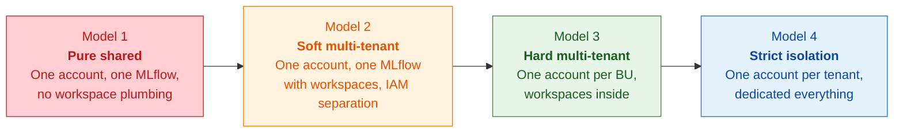
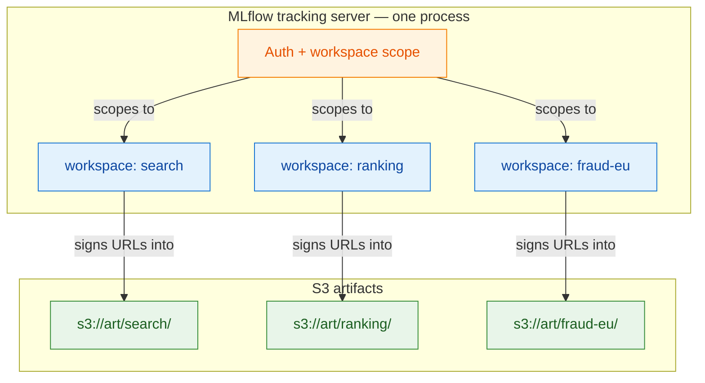
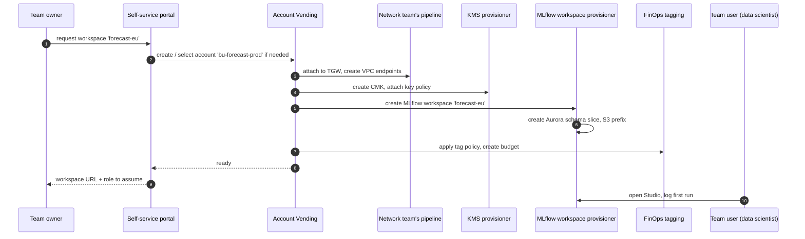
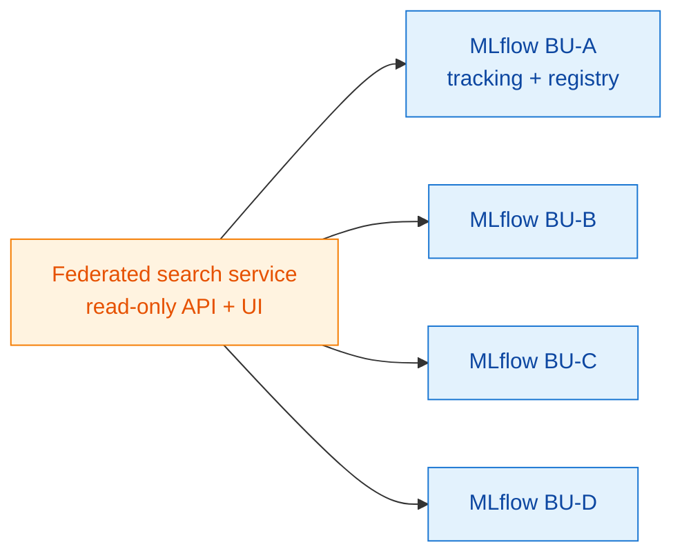
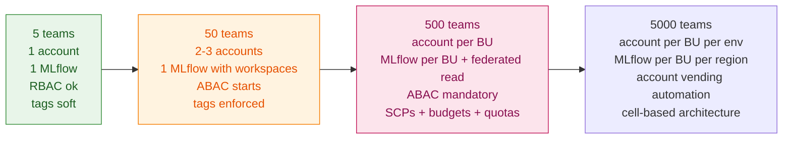

# 06 — Multi-tenant Platform Patterns

A multi-tenant ML platform is a system where one set of infrastructure serves many independent teams (tenants) safely, fairly, and without each team needing to know the others exist. This is harder than it sounds because *safety, fairness, and invisibility* pull in different directions, and the AWS-native answer (an account per tenant) and the MLflow-native answer (workspaces inside one server) are different.

This document is about how to choose, combine, and grow.

## 1. The four canonical isolation models



| | Model 1 — Pure shared | Model 2 — Soft multi-tenant | Model 3 — Hard multi-tenant | Model 4 — Strict isolation |
|---|---|---|---|---|
| **Where** | One AWS account, one MLflow workspace | One AWS account, many MLflow workspaces | One account per BU, many workspaces per account | One account per tenant, dedicated stack |
| **Tenant boundary** | None | Workspace-scoped IAM | Account boundary | Account + dedicated KMS, network, storage |
| **Cost attribution** | Tag-based, lossy | Workspace + tag | Native account-level | Per-tenant invoice |
| **Blast radius** | Whole org | Whole account | One BU | One tenant |
| **Operational cost** | Lowest | Low | Medium | High |
| **Right for** | A startup, a single product team | An early platform, a single BU growing | Most large orgs | Regulated workloads (HIPAA/PCI), customer-facing tenants |

Most companies start at Model 1, evolve to Model 2 or 3, and add Model 4 *for specific tenants* (regulated subsidiaries, external customers). The mistake is staying at Model 1 too long ("it works fine") or jumping to Model 4 prematurely ("isolation is always better") — both produce platforms that are hard to use.

## 2. Why MLflow workspaces matter

This MLflow fork has explicit workspace plumbing — see `tests/store/tracking/test_sqlalchemy_store_workspace.py` and the workspace-aware paths called out in [`CLAUDE.md`](../../CLAUDE.md). The capability matters because it lets you sit in **Model 2 or Model 3** without giving up tenant isolation in the metadata layer. Without workspaces, every team in a shared MLflow can see (or list) every other team's experiments — fine for a small org, indefensible at scale.

What workspaces buy you, concretely:

- **Namespace.** `experiment.name` is unique per workspace, not globally.
- **Authorization scope.** A token / role authorised for workspace A cannot read or write workspace B's runs, registry entries, or artifacts (assuming the artifact bucket policy mirrors the workspace).
- **Quota and rate-limit scope.** Limits applied per workspace prevent one team starving another.
- **Audit and lineage scope.** Compliance evidence is per workspace, which lines up with how teams are audited.



**Engineering rule that saves grief later.** When touching the SQLAlchemy tracking store, *never drop the workspace plumbing even if the change focuses on single-tenant behaviour* (this is also called out in `CLAUDE.md`). Workspace-aware tests should mirror new functionality in `tests/store/tracking/test_sqlalchemy_store_workspace.py`. The reason is that a future migration from single-tenant to multi-tenant becomes *very* expensive if workspace plumbing was treated as optional in intermediate states.

## 3. Account topology — the AWS Organizations layer

The AWS-native answer is "use accounts as your primary isolation boundary." Here is the topology that scales from ~10 BUs to thousands of teams without rework.

```mermaid
flowchart TB
    classDef root fill:#ede7f6,stroke:#5e35b1,color:#311b92;
    classDef org fill:#e3f2fd,stroke:#1976d2,color:#0d47a1;
    classDef ou fill:#fff3e0,stroke:#f57c00,color:#e65100;
    classDef acc fill:#e8f5e9,stroke:#388e3c,color:#1b5e20;
    classDef reg fill:#fce4ec,stroke:#c2185b,color:#880e4f;

    R[AWS Organizations root]:::root
    R --> M[Management account<br/>Control Tower, Org policies]:::org
    R --> SS[OU: Shared Services]:::ou
    R --> SEC[OU: Security &amp; Audit]:::ou
    R --> ML[OU: ML Platform]:::ou
    R --> WK[OU: Workloads]:::ou
    R --> REG[OU: Regulated]:::ou

    SS --> SS1[network-hub]:::acc
    SS --> SS2[observability]:::acc
    SS --> SS3[finops]:::acc

    SEC --> SEC1[log-archive]:::acc
    SEC --> SEC2[audit]:::acc

    ML --> ML1[ml-platform-prod]:::acc
    ML --> ML2[ml-platform-nonprod]:::acc

    WK --> W1[bu-search-prod]:::acc
    WK --> W2[bu-search-dev]:::acc
    WK --> W3[bu-ranking-prod]:::acc
    WK --> W4[bu-ranking-dev]:::acc
    WK --> W5[bu-genai-prod]:::acc

    REG --> R1[bu-fraud-pci-prod]:::reg
    REG --> R2[bu-health-hipaa-prod]:::reg
```



**Defaults that save quarters of work.**

- **Account vending.** New accounts are created from a template (Control Tower, Account Factory for Terraform, or proprietary). Day-1 contents: baseline IAM, KMS keys, VPC, VPC endpoints, log forwarders, MLflow workspace provisioned, FinOps tags applied.
- **OU-level guardrails (SCPs).** Block public S3, block disabling CloudTrail, block creation in non-approved regions, block instance types that bypass FinOps.
- **Network in shared services.** All workload VPCs route through Transit Gateway. The network team owns one place.
- **No data in the management account.** Ever.
- **Regulated OU is separate** with its own SCPs (no Bedrock unless approved, mandatory CMKs, mandatory Object Lock, mandatory log retention). This is what lets you say "yes" to a HIPAA request in a week instead of a quarter.

## 4. The IAM pattern: ABAC, not RBAC

A 5,000-team RBAC policy set is a maintenance disaster. ABAC scales because the policy stays small while the *attributes* multiply.

**Tag every principal:** `team`, `cost-center`, `data-classification`, `env`.

**Tag every resource:** the same.

**Write one policy:**

```jsonc
{
  "Version": "2012-10-17",
  "Statement": [
    {
      "Effect": "Allow",
      "Action": ["s3:GetObject", "s3:PutObject"],
      "Resource": "arn:aws:s3:::ml-artifacts-*/${aws:PrincipalTag/team}/*",
      "Condition": {
        "StringEquals": {
          "s3:ExistingObjectTag/team": "${aws:PrincipalTag/team}",
          "s3:ExistingObjectTag/data-classification": "${aws:PrincipalTag/data-classification}"
        }
      }
    }
  ]
}
```

This single statement scales to thousands of teams without changing. Add a team → tag a principal → done.

**MLflow integrates by mapping** each authenticated identity to a workspace using the same `team` attribute, so an IdC user with `team=fraud-eu` lands in MLflow's `fraud-eu` workspace and nowhere else.

## 5. The noisy-neighbour problem

The deepest multi-tenant problem isn't security — it's *fairness*. One team's bad query, exuberant retraining loop, or 1B-row trace export can ruin another team's day on shared infrastructure.

The classic offenders, ranked by frequency:

| Resource | Noisy neighbour symptom | Mitigation |
|---|---|---|
| **MLflow tracking DB** | One team logs 100M tiny metrics; queries time out for everyone | Per-workspace rate limits at the gateway; metric batch size limits in client |
| **MLflow artifact bucket** | One team writes 100M tiny artifacts; lifecycle scans hang | Per-workspace prefix + per-prefix lifecycle policy; artifact size minimums |
| **Bedrock quota (per region per model)** | One team consumes the org's Anthropic Claude quota | AI Gateway with per-team quotas; on-call gets paged before quota hits |
| **GPU capacity in shared account** | One team holds `p5.48xlarge`s 24/7 "for an experiment" | Capacity Reservations per BU; quotas; idle-detection auto-stop |
| **OpenSearch cluster (vector / search)** | One team's index growth crowds others | Index-level quotas; per-tenant clusters when the volume justifies |
| **Endpoint throughput (multi-model endpoints)** | One model dominates a shared GPU | Inference Components with per-model resource caps |

The tools to fix these are mostly *quotas, limits, and isolation*, not "be nice." Make the platform enforce limits the same way it enforces auth.

## 6. The lifecycle: how a new tenant comes online

This is the operational test of any multi-tenant platform. From "give me a workspace" to "I logged my first run" should take *minutes*, not weeks.



Day-1 deliverables for the new workspace:

- An MLflow workspace, isolated.
- An S3 prefix, encrypted with the BU's CMK.
- A SageMaker Studio domain (or extension to an existing one).
- IAM roles for *engineer*, *automation*, *read-only viewer*.
- A budget with email alerts at 50/80/100%.
- A pre-wired registry namespace.
- A pre-wired AI Gateway route to Bedrock with a per-team quota.

This is the paved road. Most "the platform is too hard to use" complaints come from missing one of these on day 1.

## 7. The compatibility contract

Multi-tenant platforms break in subtle ways when the *contract* between platform and tenants is implicit. Make it explicit:

| Contract | What the platform guarantees | What the tenant guarantees |
|---|---|---|
| **Compatibility** | MLflow client major version supported for N quarters | Will upgrade by deprecation date |
| **Quota** | Per-team quota for runs, artifacts, Bedrock tokens, endpoints | Will not exceed without prior request |
| **Cost** | Per-team budget visible in dashboard | Owns the budget; sets alerts |
| **Availability** | 99.9% on tracking, 99.95% on registry, 99.99% on inference paved road | Builds within the SLOs given |
| **Support** | On-call paged on platform incidents | Provides app on-call for app incidents |
| **Lineage** | Run-to-registry-to-endpoint chain queryable | Doesn't bypass with manual deploys |

**Versioning the contract.** When the contract changes (a new major MLflow, a new IAM pattern, a new tagging schema), version it: `platform-contract-v3`. Tenants are on a contract version; migrations are coordinated. This avoids "we changed how MLflow handles X and broke 50 teams overnight."

## 8. Federation: the global view across tenants

The valid researcher complaint is: "I want to find my colleague's experiment in another BU." With per-BU MLflow servers, you need a *federated read layer*.



Mechanism: each BU's MLflow exports run metadata (not artifacts) to a central index — Glue + Athena, or OpenSearch — on a regular schedule. Researchers query the index ("find runs with metric `auc > 0.9` tagged `topic=ranking`") and follow links into the per-BU MLflow.

What you do *not* federate:
- Artifacts (would defeat data-residency isolation).
- Write paths (the per-BU server is the source of truth).
- Cross-BU promotion (a model promoted in BU-A has no meaning in BU-B until BU-B adopts it explicitly).

## 9. The growth story — 5 teams to 5,000

Walk the same platform through three sizes, marking what changes.



The transitions are bounded:

- **5 → 50:** introduce workspaces, introduce ABAC. ~1 quarter of work.
- **50 → 500:** introduce per-BU accounts, federated read, paved-road tiers. ~2 quarters.
- **500 → 5,000:** introduce account vending automation, regional split, cell-based architecture. ~1 year.

Each transition is *manageable* if you preserved the right invariants in the previous stage (workspace plumbing, ABAC, tags). Each transition is *catastrophic* if you didn't.

## 10. The shortlist of mistakes

1. **Treating workspaces as optional during single-tenant phase.** Re-introducing workspace plumbing later is months.
2. **RBAC at scale.** Hits IAM policy size limits. Hard to undo.
3. **One bucket for all artifacts, with prefixes per team but no bucket policy.** A typo deletes another team's runs.
4. **Tags as documentation, not enforcement.** Cost attribution is permanently lossy for resources launched untagged.
5. **No federated read layer.** Researchers route around the platform — they grep S3 directly, or worse, copy data.
6. **Per-tenant snowflakes that started as escape hatches.** They become the rule. Document them as a *tier*, or kill them.
7. **No deprecation policy.** Every change has to support every version forever; migrations stall.
8. **Quota only at the AWS level.** AWS quotas protect AWS; per-team quotas at *your* gateway protect your platform from itself.

Continue with [Compliance & data residency →](07-compliance-data-residency.html).
