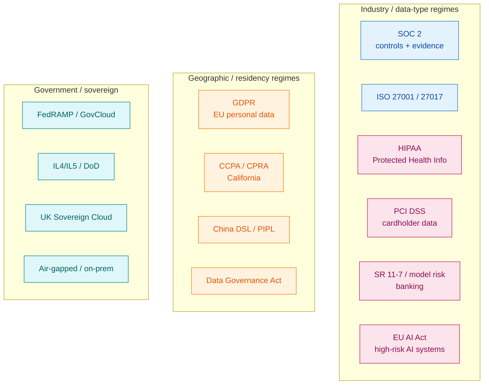
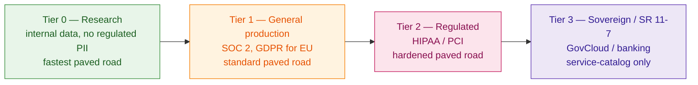
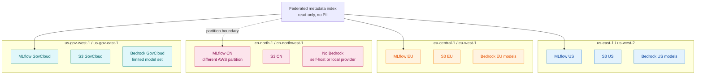

# 07 — Compliance & Data Residency

Compliance is the constraint dimension that hits the most layers at once. A SOC 2 conversation is a chat. A HIPAA conversation rewrites identity, networking, storage, MLflow, and governance. A GDPR conversation pins your data to a region. An SR 11-7 conversation makes your registry a regulator artifact.

This document is about how to design the platform so it can *say yes* to a new compliance scope in weeks, not quarters, and how to draw the line between things you build once and things you fork per regime.

## 1. The compliance landscape, in one map



Most large companies face several of these simultaneously: SOC 2 baseline + GDPR for EU users + HIPAA for one product + PCI for billing + GovCloud for one customer. The platform's job is to make those *additive*, not multiplicative.

## 2. The "tier" model that works

Don't try to make one paved road handle everything. Don't make every team build their own. Tier it.



Each tier inherits from the previous and adds. **Tenants don't pick the tier; the data classification does.** A team handling cardholder data is in Tier 2 whether they like it or not.

| Layer | Tier 0 | Tier 1 | Tier 2 | Tier 3 |
|---|---|---|---|---|
| **1. Identity** | Group-based RBAC | ABAC + access reviews | ABAC + JIT + break-glass | + independent validator identity |
| **2. Networking** | Public ALB internal-only | Private ALB, VPC endpoints | Egress allow-list | Air-gapped option |
| **3. Storage** | SSE-S3 | SSE-KMS, CMK | + Object Lock, lifecycle enforced | + WORM + off-region backup |
| **4. Compute** | Studio + on-demand | Spot ok, image scanning | Hardened images, image-pull from ECR only | Service Catalog products only |
| **5. MLflow** | Default | Audit log + retention | Hardened: SSO-only, immutable runs | + run history is regulator artifact |
| **7. Registry** | Free promotion | Eval gate | + fairness + adverse-action report | + independent validation, 7-yr retention |
| **9. Inference** | Any | WAF in front | + private endpoint, no public DNS | + change control, no canary without approval |
| **10. Observability** | CW logs | CW + 90 days | CW + 7-yr cold | + access logs replicated to validator |
| **11. Governance** | Quarterly review | Templated approvals | Continuous evidence (Audit Manager) | Per-deploy evidence package |
| **12. FinOps** | Tags helpful | Tags required | Tags enforced | + cost-of-control tracked |

The vertical bars between tiers are the *boundary* — a Tier 1 workload should not be able to *accidentally* become Tier 2 by changing some IAM. Tiers map to **separate AWS accounts**, often **separate OUs**.

## 3. Tier 2 deep dive — HIPAA on AWS with MLflow + SageMaker + Bedrock

A practical recipe for a HIPAA-scoped workload (Persona 4-like, with PHI in scope).

### Account and BAA

- Account is a member of the **Regulated OU**, with SCPs blocking:
  - Use of services not in AWS's HIPAA-eligible list.
  - Public S3 / public ALB.
  - Disabling CloudTrail.
  - Regions outside an approved list.
- AWS signs a **BAA** at the account level. PHI may flow through eligible services only.
- A separate operations team or a clearly-scoped subset of the platform team is the *delegated administrator*.

### Identity and access

- IAM Identity Center group `hipaa-eligible-users` gates *who can even assume into the account*. Membership requires HIPAA training certification (audited annually).
- All access is via *time-bound assumed roles* — JIT, with break-glass for incident response.
- No long-lived IAM users. No long-lived access keys.

### Networking

- VPC with **no internet gateway**. Egress to AWS services via Interface Endpoints (S3, KMS, STS, SageMaker API, SageMaker Runtime, **Bedrock Runtime**, CloudWatch Logs, ECR).
- Egress to anything else: blocked, or routed through a Network Firewall with an allow-list.
- All ingress: through VPN or PrivateLink from controlled networks.

### Storage

- S3 bucket per workspace, **with KMS CMK** owned in the HIPAA account (key policy, not cross-account).
- **S3 Object Lock** in compliance mode for production model artifacts and tracking exports — they cannot be silently overwritten.
- Lifecycle: hot 1 year, IA 1 year, then Glacier with retention enforced for the regulator's required period (often 7 years).
- Aurora Postgres with CMK encryption at rest, IAM authentication, audit logging on. Multi-AZ.

### MLflow

- Self-hosted (Mode A from [03](03-mlflow-on-sagemaker.html)), in the HIPAA account.
- Auth via Identity Center; no API keys.
- Tracking server emits an audit event to CloudWatch Logs for every write (run create, metric log, artifact upload, registry transition). Logs replicated to the central audit account immediately.
- Run history is **immutable** — deletes are blocked at the application level for runs in the production registry.
- Retention configured for the regulator's window.

### SageMaker

- Studio domains in **VPC-only mode** (no internet, no shared notebook storage).
- Custom Studio image, scanned for vulnerabilities, pulled from internal ECR.
- Training Jobs: VPC-only, with Inter-Container Encryption on multi-node jobs.
- Endpoints: in-VPC, behind WAF, never public.
- SageMaker Model Monitor configured per endpoint. Drift alerts route to security as well as product.

### Bedrock

- Bedrock is HIPAA-eligible *for many models in many regions*, but the team must verify model-by-model and pin to the eligible set.
- All Bedrock calls go through the AI Gateway. Gateway enforces:
  - Bedrock Guardrails for PII redaction in inputs and outputs.
  - Allow-list of model IDs.
  - Per-team quota.
  - Per-call audit log.
- Bedrock Knowledge Bases used only with KB-eligible vector storage and BAA-covered data flow.

### Governance

- Every model promoted to `@production` requires:
  - Signed-off owner.
  - Eval suite pass.
  - Fairness / bias assessment if the model affects clinical or patient-facing decisions.
  - Adverse-event explainability artifact (SageMaker Clarify report).
  - Change-control ticket linked from the registry transition.
- Audit Manager assesses HIPAA controls continuously; evidence stored in the audit account.
- Quarterly access reviews automated; failure to re-attest revokes access.

### Bedrock-specific HIPAA caveat

Bedrock's HIPAA eligibility expands over time. **Pin** the eligible-model list in code (the AI Gateway's allow-list) and update it deliberately — don't let the allow-list become "anything Bedrock offers." Audits are easier when the allow-list is small and explicit.

## 4. PCI DSS specifics

If cardholder data ever enters the workload:

- **Reduce scope first.** The cheapest PCI workload is one that does not touch cardholder data. Tokenise (e.g. Stripe-style tokens, AWS Payment Cryptography) at the edge, and keep tokens — not PANs — in your ML datasets.
- **Quarterly scans** of every internet-facing endpoint. Easier when you have *no* internet-facing endpoints (private only).
- **Strict change control.** PCI auditors care more about *who approved the deploy* than about the model. The registry promotion record + change ticket linkage is the audit artifact.
- **Logging.** PCI requires specific log fields and 1-year online + retention beyond. CloudWatch Logs + replication to S3 (with Object Lock) is the standard pattern.
- **Network segmentation.** PCI scope is narrowed by network segmentation. The PCI workload's VPC should be isolated, with explicit allow-list to dependencies.

## 5. SR 11-7 / model risk management

Banking and insurance use *model risk* frameworks (the US Federal Reserve's SR 11-7 is the canonical one). The platform implications differ from technical compliance frameworks.

| SR 11-7 requirement | Platform implication |
|---|---|
| Model inventory | The MLflow registry, augmented with non-MLflow models, becomes the official inventory. The platform must produce a queryable inventory report on demand. |
| Independent validation | A separate validator team has *read-only* access to runs, datasets, model artifacts, eval reports. They produce a validation report that is linked from the registry version. |
| Conceptual soundness review | A document attached to the registry version, signed off by the validator. |
| Ongoing monitoring | SageMaker Model Monitor + a documented response process for breaches. |
| Outcomes analysis | Prediction-vs-outcome reports on a defined cadence, archived. |
| Change control | Every model change is a "model change event" with documented impact analysis. |

This regime *cannot tolerate* "the production model is whatever artifact happens to be in the endpoint." The registry must be the source of truth, the deployment must always come from the registry, and the lineage from data → run → eval → registry → endpoint must be queryable.

**Bedrock under SR 11-7.** Generally not in scope for production credit / underwriting decisions until: (a) the bank has documented the model's conceptual soundness from public material, (b) Bedrock provides versioned model snapshots with documented changes, and (c) the bank's MRM team has accepted the residual risk. Most banks restrict Bedrock to lower-risk uses (internal tools, drafting, summarisation) initially.

## 6. EU AI Act and similar high-risk-AI laws

The EU AI Act applies to AI systems based on *risk class*. Recommendation systems, credit decisions, hiring, biometric ID and others are *high-risk* and require:

- A risk management system.
- Data governance (datasets must meet quality criteria; this is a feature-store and tracking concern).
- Technical documentation (the registry + model card).
- Record-keeping (the trace + run history).
- Human oversight (deployment patterns).
- Accuracy, robustness, cybersecurity (the eval suite).
- Conformity assessment.

**The platform implication is that *for high-risk systems*, several things you might consider optional become mandatory:** dataset hashing in MLflow runs, eval reports linked to model versions, model cards generated automatically from registry metadata, audit trails of who did what.

The good news is that the MLflow + SageMaker + Bedrock combination *already produces* most of these artifacts. The platform's job is to make them automatic and queryable rather than artisanal.

## 7. Data residency

Residency is simpler than industry compliance but more architecturally invasive: it forces *physical* separation.



Key facts that drive design:

- **AWS partitions are hard boundaries.** `aws-cn` (China) and `aws-us-gov` (GovCloud) are technically separate AWS deployments. IAM, accounts, even DNS endpoints differ. You cannot federate identity across them — you stand up a parallel platform.
- **Bedrock model availability is region-specific.** Plan model selection per region. Don't assume a model in `us-east-1` is in `eu-central-1`.
- **Data cannot cross.** EU PII cannot replicate to US. The MLflow tracking *server* is regional; even *metadata* federation should exclude PII fields.
- **Researchers want one view.** The right answer is a metadata-only federated read layer (run names, dates, owners, tags, *no artifacts, no model parameters, no datasets*), with deep-links into the per-region MLflow.

## 8. Air-gapped and on-prem

When a workload genuinely cannot use the public AWS regions:

- **AWS Outposts** brings AWS services on-prem; some services available, MLflow and SageMaker support varies.
- **AWS Snow Family** for one-time data transfer; not a runtime.
- **Self-host on-prem.** MLflow on Kubernetes on-prem, S3-compatible object store (MinIO, Pure FlashBlade S3), Postgres on VM. Bedrock is unavailable; either self-host FMs (Llama, Mistral) or use a regional provider.
- **The connective tissue** between the on-prem platform and the cloud platform is usually *one-way* — promoted models exported as artifacts and re-imported into the cloud registry, or vice versa. Not federated.

The architecture shape stays the same; the implementations differ. This is why we keep saying *the layered model is portable*.

## 9. The audit trail as a first-class platform feature

Every regulated workload has the same fundamental question: *"Show me the chain from data to decision."* If the platform answers that question with one query, audit is cheap. If the platform answers it with "let me check Slack and S3 and an old ticket," audit is a quarterly fire drill.

The chain:

```mermaid
flowchart LR
    classDef src fill:#e8f5e9,stroke:#388e3c,color:#1b5e20;
    classDef art fill:#e3f2fd,stroke:#1976d2,color:#0d47a1;
    classDef end fill:#fff3e0,stroke:#f57c00,color:#e65100;

    DATA[Source dataset<br/>S3 + version + hash]:::src
    DATA --> RUN[MLflow run<br/>params, metrics, code commit, dataset URI, owner]:::art
    RUN --> MODEL[MLflow model artifact<br/>signature, env, flavor]:::art
    MODEL --> EVAL[Eval report<br/>linked from run]:::art
    EVAL --> REG[Registry version<br/>alias @production, transition log, approver]:::art
    REG --> DEPLOY[Deployment<br/>endpoint, version, time, deployer]:::end
    DEPLOY --> PRED[Prediction record<br/>request, output, model version, time, user]:::end
    PRED --> OUTCOME[Business outcome<br/>conversion, chargeback, decision]:::end
```

Every arrow above is a recordable event. **The platform's job is to record them automatically** — through MLflow, through CloudTrail, through Model Monitor, through your inference logging. When all the arrows are recorded, *one query reconstructs the chain* and the auditor leaves quickly.

When even one arrow depends on a person remembering to log it, you don't have an audit trail; you have hope.

## 10. The "fork what, share what" question

The deepest question in compliance architecture is: *which parts of the platform are shared across tiers, and which parts are forked?*

| Layer | Share across tiers | Fork per tier |
|---|---|---|
| **Patterns and templates** | Identity patterns, IaC modules, MLflow schema, registry contract | — |
| **Build pipelines** | Container build, image scan, IaC validation | Image hardening differs by tier |
| **MLflow code** | Same source tree | Per-tier deployment with per-tier config |
| **Account topology** | — | Forked: separate accounts per tier |
| **KMS keys** | — | Forked: per-account / per-BU |
| **Network** | TGW topology | Forked: per-tier VPCs, per-tier egress policy |
| **Data buckets** | — | Forked: per-tier S3 with per-tier policy |
| **Observability tooling** | Same platform (Grafana, CW) | Forked retention, forked replication targets |
| **Documentation** | Same docs site | Per-tier addenda |

The *code* and *patterns* are shared. The *data* and *infrastructure instances* are forked. This is the single most important rule for not paying 4× engineering cost for 4× tiers.

## 11. The shortlist of mistakes

1. **One platform for all tiers.** Either you over-build for Tier 0 or under-build for Tier 2. Neither lands.
2. **HIPAA / PCI bolted on later.** Always more expensive than building separation in from day one.
3. **Audit trail as a manual artifact.** Doesn't survive turnover.
4. **Sharing CMKs across tiers.** Defeats the point of CMKs.
5. **Federated MLflow that includes artifacts.** Crosses the residency boundary you swore you wouldn't.
6. **Bedrock allow-list = "all models."** Auditors want to see a small, justified list.
7. **Regulator-relevant runs without owner attribution.** "Whoever was on the laptop" doesn't satisfy SR 11-7.
8. **Treating compliance as the security team's job.** Compliance is a platform feature, not a checklist someone audits afterwards.

Continue with [Cost & FinOps for ML platforms →](08-cost-and-finops.html).
