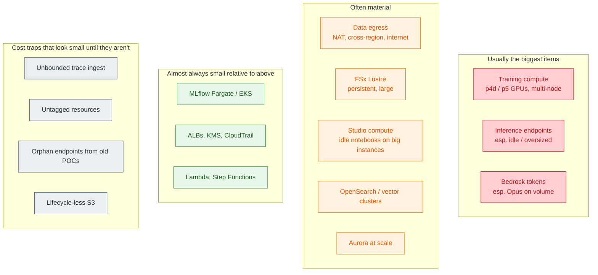
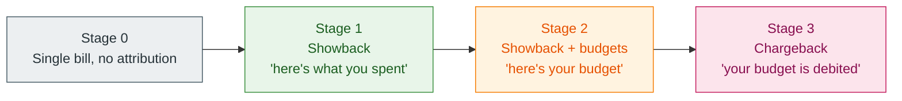
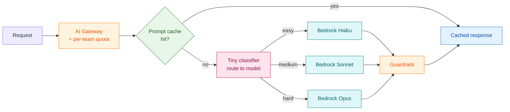
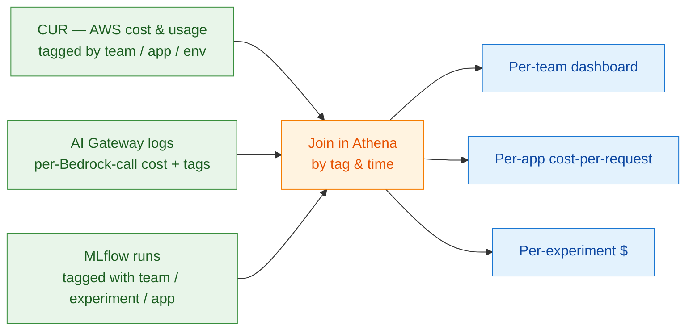

# 08 — Cost & FinOps for ML Platforms

ML platform cost discussions go off the rails because people argue about the wrong line item. The MLflow tracking server costs roughly nothing. The Aurora behind it costs roughly nothing. **What costs money is the compute the platform tracks** — training jobs, idle endpoints, Bedrock token spend, data egress.

This document is about (a) understanding where the dollars actually go, (b) the levers that move them most, (c) the tagging discipline that makes attribution possible at all, and (d) how to evolve from showback to chargeback without losing your customers.

## 1. The cost map

**The rule of thumb that decides priorities.** Optimising the small layer to zero won't matter; optimising the big layer by 10% will. Spend FinOps attention proportionally.

## 2. Where dollars go, by persona

For each persona from [02](02-team-personas-and-scenarios.html), the dominant cost drivers differ. Knowing this guides which lever you push.

| Persona | Dominant cost | Secondary | Lever that matters most |
|---|---|---|---|
| 1. Recommendations | Inference endpoints (always-on, high QPS) | Training (frequent retrains) | Right-size endpoints, autoscale, multi-model endpoints |
| 2. Forecasting | Batch compute (large periodic jobs) | S3 storage (history) | Spot for batch, S3 lifecycle, partition pruning |
| 3. Search / LTR | Studio compute (heavy experimentation) + index | OpenSearch | Studio idle-stop, index right-sizing |
| 4. Fraud / risk | Inference endpoints + Model Monitor | Compliance overhead | Right-size endpoints, sampled monitoring |
| 5. Computer vision | Training GPUs (long, large) + FSx | Storage | Spot + checkpointing, FSx scratch tiers |
| 6. Speech / voice | Edge fleet costs + training | Transfer | On-device inference, regional model versions |
| 7. Robotics / edge | Edge fleet + sim training | Transfer | Sim-on-spot, fleet-aware deploy |
| 8. GenAI apps | **Bedrock tokens** | Retrieval / vector | Model cascading, caching, context compression |
| 9. FM fine-tuning | **Massive GPU clusters** | Storage | Capacity Reservations, Bedrock Custom Model Import (skip self-hosting) |
| 10. AutoML | Many small training jobs + serverless | Storage | Quotas, default-shutdown |
| 11. Risk / compliance ML | Lower compute, **high process overhead** | Audit storage | Reuse paved-road tooling; the cost is people |
| 12. Platform team | Aurora + Fargate + observability | — | Multi-tenancy reduces per-team unit cost |

**Two persona-specific lessons.**

- **Persona 1 and 8 are where the bulk of dollar leakage happens.** Always-on endpoints and Bedrock token sprawl. FinOps should focus here first.
- **Persona 11 has low cloud cost and high people cost.** Don't over-engineer technology to "save money" when the saving is months of engineer time on a workload whose cloud bill is small.

## 3. The seven levers, ranked by usual impact

### Lever 1 — Right-size and autoscale endpoints (Persona 1, 4, 5)

The single largest leak in most platforms is endpoints provisioned at peak capacity 24/7. A `ml.g5.12xlarge` running idle at 3am is the same dollar as one serving traffic.

- **Default to autoscaling** with a sane min/max and a target metric (CPU, GPU utilisation, or invocations per instance).
- **Use SageMaker Inference Components** for multiple models on shared GPUs. Pay for the GPU; share among models with predictable contention.
- **Use Serverless Inference** for spiky low-volume models. Pay per invocation; cold-start cost is the trade.
- **Kill orphans.** A weekly report of endpoints with < 1 RPS over 30 days, sent to owners, with auto-shutdown after a deprecation window.

Order of magnitude: 30–70% reduction on endpoint spend on most platforms.

### Lever 2 — Spot + checkpointing for training (Persona 2, 5, 9)

Spot is 60–90% cheaper than on-demand. Use it.

- **Make checkpointing the default** in the paved-road training template. Crashes are recoverable.
- **For multi-day jobs**, use SageMaker Managed Spot Training with checkpointing.
- **For fragile or short jobs**, on-demand or Capacity Blocks; the spot interruption rate is too disruptive.

Order of magnitude: 50% reduction on training spend if Spot was previously not used.

### Lever 3 — Bedrock model cascading and caching (Persona 8)

The default "use Opus for everything" pattern is 5–20× more expensive than necessary on most workloads.

- **Cascade.** Cheap classifier → if confident, answer with Haiku/Sonnet; if not, escalate to Opus. Most queries don't need Opus.
- **Cache** with Bedrock prompt caching. System prompts, long contexts, RAG context — all cacheable. Prove cache hit rate per app via MLflow tracing; targets like > 50% are realistic on stable system prompts.
- **Compress retrieval context.** Long retrieved chunks → reranker → top-k → summarised → final LLM call. Cuts input tokens by 3–10×.
- **Provisioned Throughput** if you have predictable high QPS on a single model. Reserves capacity at fixed monthly cost; sometimes cheaper than on-demand.

Order of magnitude: 60–95% reduction on a workload that started naive.

### Lever 4 — Storage tiering and retention (everyone)

Storage compounds. A platform that doesn't tier or expire pays linearly more every month forever.

- **MLflow artifacts:** lifecycle to S3 IA after 90 days, Glacier after a year, expire after policy retention (or never, for regulator-bound).
- **MLflow tracking metadata:** Aurora storage grows with runs, metrics, traces. **Delete or archive** runs in dead experiments; archive trace data older than 30 days to S3 Parquet for Athena.
- **Studio user storage (EFS):** quotas. Without them, EFS becomes a graveyard of `~/Downloads/`.
- **OpenSearch / vector indexes:** delete indexes for retired models.

Order of magnitude: 30–70% reduction on storage spend if no policy existed.

### Lever 5 — Egress and NAT discipline (everyone)

NAT gateway data processing is per-GB and adds up fast. So does cross-region transfer.

- **VPC Gateway Endpoint for S3** is free. Use it for all S3 traffic from VPCs.
- **Interface Endpoints** for SageMaker, Bedrock, KMS, ECR, CloudWatch keep traffic off NAT.
- **Cross-region replication:** only what's needed. Multi-region MLflow artifacts in *both* regions usually means double the cost; tier the secondary aggressively.
- **Internet egress:** routed through the network firewall account; a single dashboard makes the source visible.

Order of magnitude: 50–90% reduction on NAT/egress where this was unmanaged.

### Lever 6 — Studio / notebook idle stop (Persona 3, 5, 10)

Notebooks left running on GPU instances are free money for AWS.

- **Default Studio app shutdown** after 1 hour idle.
- **Quota** on instance types in dev domains — `ml.p4d.24xlarge` not available in research workspaces; available in approved training-only environments.
- **Daily report** of long-running Studio apps, by user; auto-stop after a weekend of no activity.

Order of magnitude: 20–40% reduction on Studio spend.

### Lever 7 — Trace and log sampling (Persona 8 at scale)

GenAI tracing at 100% sample on a high-QPS production app generates real volume — Aurora pressure, S3 cost, downstream eval cost.

- **Sample by default** at production scale (1–10%).
- **Always log incidents.** A failed turn, a guardrail trip, a low-confidence answer — these are 100%-sampled.
- **Always log eval inputs.** Curated datasets, regressions, golden examples.
- **Tier traces** to S3 Parquet for cheap querying; expire from Aurora aggressively.

Order of magnitude: depends on baseline; often 70%+ reduction on trace storage.

## 4. The tagging discipline

You cannot optimise what you cannot attribute. Tagging is the foundation of every other FinOps activity.

**Mandatory tags on every resource (enforced at provisioning):**

| Tag | Example | Why |
|---|---|---|
| `team` | `ranking` | Per-team showback |
| `cost-center` | `eng-1234` | Finance roll-up |
| `env` | `prod`, `staging`, `dev` | Slice prod from research |
| `data-classification` | `public`, `internal`, `pii`, `phi` | Compliance + cost-tier alignment |
| `mlflow-workspace` | `ranking-eu` | Tie cloud cost to MLflow workspace |
| `application` | `homepage-ranker` | Per-app dashboards |
| `owner` | `alice@example.com` | Reach out when costs spike |

**Enforcement:**

- **AWS Tag Policies** at the OU level enforce *which tags are allowed* and *what values are valid*.
- **Service Control Policies** can block resource creation that lacks required tags. Use this for environments where tagging matters (prod accounts).
- **Account vending** stamps the account-wide defaults at creation; resources inherit.
- **Audit:** AWS Config rules report on untagged resources, dashboards visible to FinOps and team owners.

**Reality check.** No org gets to 100% tagged. Get to 95%+, accept the rest as a manageable known.

## 5. The showback-to-chargeback evolution

Most orgs follow this arc. Skipping a step usually fails.

| Stage | What changes | Risk if you skip |
|---|---|---|
| Showback | Dashboards per team. No financial consequences. Builds trust. | If you jump to chargeback before tags are accurate, teams revolt. |
| Showback + budgets | Soft budgets per team. Alerts at 50/80/100%. | Without budgets, showback becomes wallpaper. |
| Chargeback | Internal cost transfer. Real money moves. | Now teams have an incentive to optimise — and to game tags. Audit your tagging. |

**The MLflow-specific dimension.** Tagging at the AWS level is necessary but not sufficient. *Per-MLflow-experiment* and *per-Bedrock-route* attribution lives one layer higher: the AI Gateway tags every Bedrock call with team / app, and MLflow runs carry tags that map back to AWS cost centres. The combination lets you say "this experiment cost X, of which Y was Bedrock and Z was training."

## 6. The Bedrock cost playbook

Bedrock deserves its own subsection because it is unfamiliar enough that teams burn through budgets quickly.

### Pricing dimensions (the ones that bite)

- **Input + output tokens, per model.** Opus is ~5× Sonnet which is ~5× Haiku.
- **Provisioned Throughput** is hourly + commitment; cheaper at high steady QPS, expensive if underused.
- **Cross-Region Inference** counts against quotas in any region used.
- **Bedrock Knowledge Bases** charges for retrieval requests + chunking + embedding (separately from chat).
- **Guardrails** are charged per call; non-trivial at very high QPS.
- **Custom Model Import / Fine-tuning** has per-job and per-storage costs.

### The cost-conscious Bedrock pattern

Each component pays for itself many times over at moderate scale.

### Per-app cost SLI

Make "$ per request" a first-class metric per app. Visible in the app team's dashboard, alerted when it drifts up. Pair it with quality metrics (eval scores) so the team optimises for *cost per quality unit*, not *cost alone*.

## 7. The cost-of-control axis

Compliance and high reliability cost real money beyond the workload itself. Make these visible separately.

| Cost-of-control item | Typical $ |
|---|---|
| Multi-region active-passive (storage, replicas) | 1.3–1.6× of single-region |
| HIPAA / PCI tier (KMS, audit log retention, hardened images, JIT identity) | 5–15% over baseline |
| Compliance evidence collection (Audit Manager, Config, GRC tools) | Few thousand $/mo per account |
| Object Lock retention (years of immutable storage) | Linear with model artifact volume × retention |
| WAF, Shield Advanced, GuardDuty | Per-account fixed cost |
| Independent validation team licences (separate identity, dashboards) | Per-validator $$ |

These appear in a different cost category — `compliance-overhead`, `reliability-overhead` — not in the model team's budget. Otherwise, every ML team perceives compliance as their cost, and resists it. **Pricing visibility = political stability.**

## 8. The dashboards that matter

Build (or buy) these four. Most other dashboards are subsets.

1. **Per-team monthly trend.** Last 12 months, by service. The "what's growing" view.
2. **Per-app cost-per-request / cost-per-prediction.** The unit economics view; the only thing that proves the platform is improving over time.
3. **Top 20 resource list, weekly.** The single most expensive 20 resources in the org. Usually 5 of them are surprises.
4. **Untagged spend %.** A KPI for FinOps; every month, push it down.

Build them on **CUR → Athena → QuickSight or Grafana**. CUR is free to enable; Athena and QS are pennies for this use case.

## 9. The MLflow + Bedrock cost-attribution chain

The chain that makes per-app cost attribution possible:

Without all three sources, the chain breaks. AWS-only cost (CUR) doesn't see Bedrock spend per app (it's all "Bedrock service"). Bedrock-only spend (Gateway logs) doesn't see training and storage. MLflow-only doesn't see infra. **All three together** answer "what did experiment X actually cost end-to-end?"

## 10. The shortlist of mistakes

1. **Optimising the platform's own infra cost first.** The platform is rounding error vs the compute it tracks.
2. **No tagging discipline.** Attribution is permanently lossy for untagged resources.
3. **Always-on endpoints "for safety."** The single biggest leak.
4. **Bedrock with no model cascading.** Pays Opus prices for Haiku jobs.
5. **No retention on tracking / traces.** Aurora goes to terabytes; restore takes a weekend.
6. **Chargeback before tagging is mature.** Teams revolt; project gets killed.
7. **Compliance cost charged to model teams.** Teams resist compliance; security loses.
8. **No per-app cost-per-request metric.** Without it, every team's spend just grows.

Continue with [Decision framework →](09-decision-framework.html).
