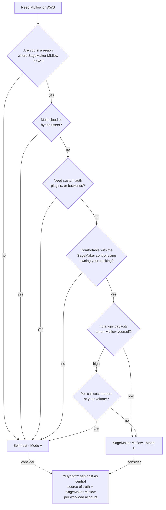
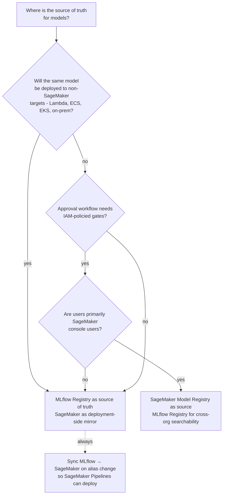
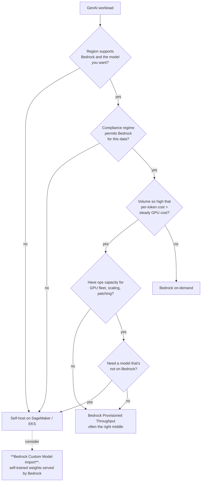
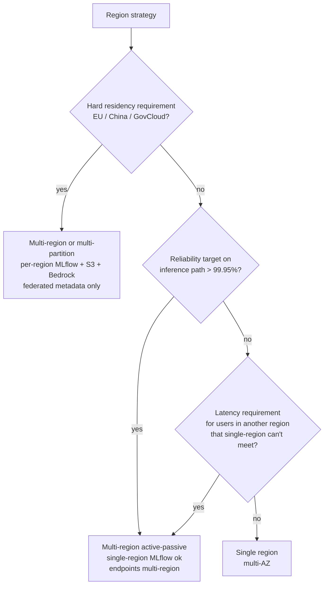
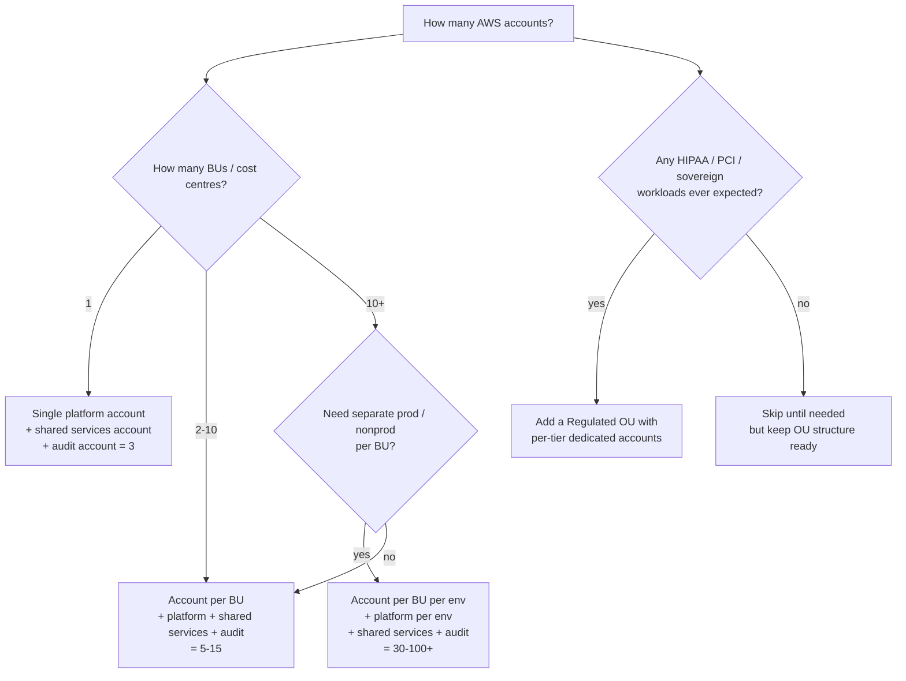
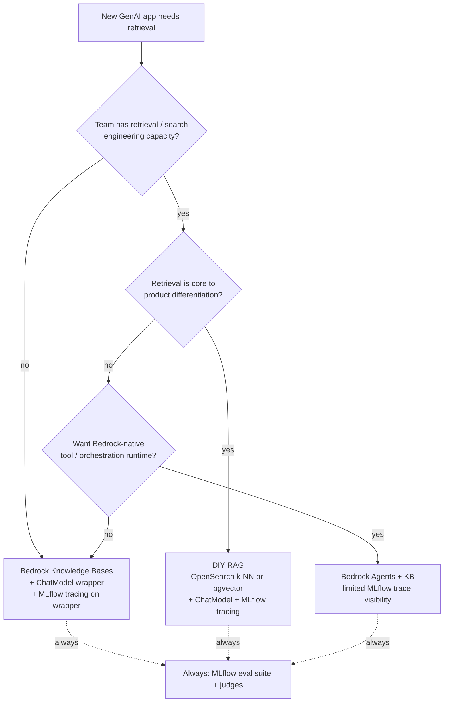
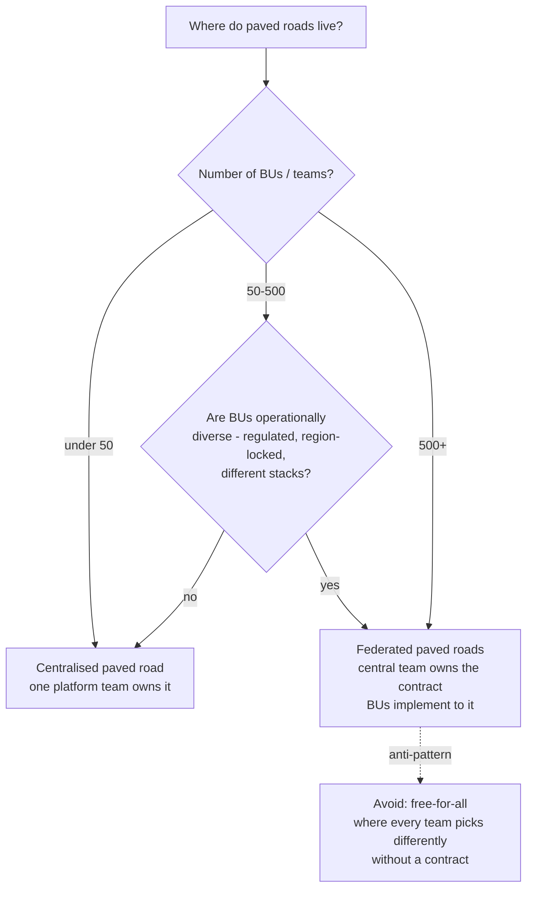
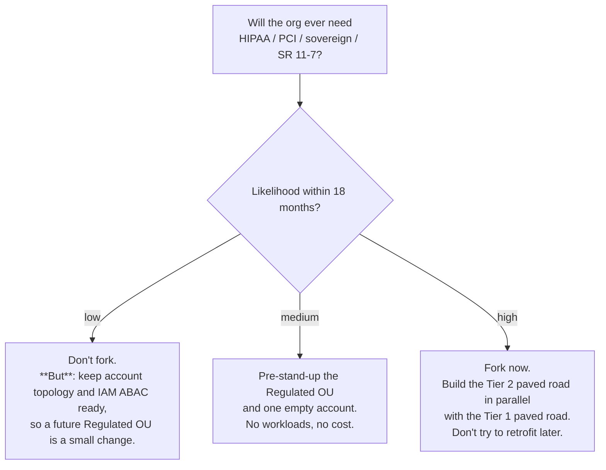
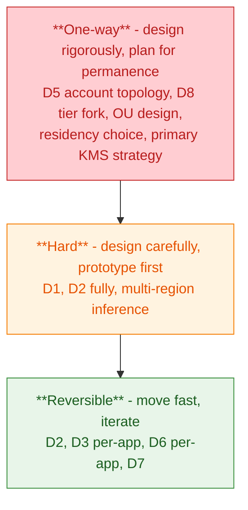

# 09 — Decision Framework

The previous documents argued that *constraints choose architectures*. This document is the working tool: a small set of decision trees and checklists you can apply to the questions that actually come up. Each decision is also tagged on a *reversibility* scale — how expensive is it to change later — because that determines how much design effort is warranted.

We organise around **eight decisions** that we see come up over and over.

| # | Decision | Reversibility |
|---|---|---|
| D1 | Self-hosted MLflow vs SageMaker MLflow | Reversible (with effort) |
| D2 | MLflow Registry vs SageMaker Model Registry vs both | Mostly reversible |
| D3 | Bedrock vs self-hosted FMs | Per-app reversible |
| D4 | Single-region vs multi-region | **Hard to reverse** |
| D5 | Account topology (account-per-team vs per-BU vs shared) | **Very hard to reverse** |
| D6 | RAG architecture (DIY vs Bedrock KB vs Bedrock Agents) | Per-app reversible |
| D7 | Centralised paved road vs federated | Reversible |
| D8 | Tier-2/3 (HIPAA/PCI) — fork now vs later | **Very expensive to reverse** |

We'll work them in roughly that order.

---

## D1 — Self-hosted MLflow vs SageMaker MLflow

**Reversibility: medium.** Migrating between modes is doable in weeks, not months, *if* the registry contract has been clean and artifacts have been in S3 (not on local disk).

**Default for most large orgs:** the **hybrid** answer. Self-hosted MLflow as the central, long-lived registry/tracking source of truth in the platform account, plus SageMaker MLflow exposed *to users* in workload accounts that sync into the central registry on transition events. Costs slightly more in operations and licence, gains substantially in user experience and durability.

---

## D2 — MLflow Registry vs SageMaker Model Registry

**Reversibility: mostly reversible.** Both registries can coexist; the question is which is *the source of truth*.

**Default:** MLflow Registry as the source of truth, with a sync to SageMaker Model Registry on registry transition (alias change to `@champion` etc.). This keeps the tracking-to-registry-to-deployment lineage one-directional and clean, and lets non-SageMaker deployment targets read from the same registry.

The SageMaker MLflow managed offering does this synchronisation for you out of the box.

---

## D3 — Bedrock vs self-hosted foundation models

**Reversibility: per-app reversible.** Switching one app from Bedrock to a self-hosted FM (or vice versa) is bounded work — provided the app calls through the AI Gateway abstraction.

**Default:** **Bedrock**, on-demand for variable workloads, Provisioned Throughput when QPS justifies it. Self-host is the exception, not the rule. Even when self-hosting a fine-tune, **Bedrock Custom Model Import** often beats running your own SageMaker endpoints — you get Bedrock's ops, scaling, and integrations without paying GPU rental directly.

---

## D4 — Single-region vs multi-region

**Reversibility: hard.** Going from single-region to multi-region is a multi-quarter project. Going from multi-region back to single-region is rare and usually means an architectural collapse.

**Two important decoupled answers.** *Inference multi-region* and *MLflow multi-region* are independent decisions. Most orgs have inference in two regions long before they have MLflow in two regions. The MLflow side is harder (data gravity, schema migration, federated read layer) and almost never needs to be done unless residency forces it.

**Default:** single region with multi-AZ for the MLflow + storage + control plane, multi-region for the inference path when reliability demands. Federation only when residency demands.

---

## D5 — Account topology

**Reversibility: very hard.** Splitting accounts after the fact is one of the most expensive migrations in cloud. Get this right early.

**Defaults at common sizes:**

- **Startup / single product:** 3 accounts. Don't over-engineer.
- **Mid-stage / 5 teams:** ~5 accounts (platform, shared services, audit, prod, nonprod).
- **Large / 50 teams:** ~30+ accounts (account per BU per env, plus shared).
- **Amazon-scale:** hundreds to thousands of accounts, with account vending automation as a paved road of its own.

**The one-way door:** the *OU structure* you commit to in Year 1 will outlive 90% of the engineers. Spend a quarter designing it. The accounts can come and go; the OU shape is forever.

---

## D6 — RAG architecture

**Reversibility: per-app, mostly reversible.** Switching one app from DIY RAG to Bedrock KB is bounded; switching all of them in a quarter, less so.

**Default:** **Bedrock Knowledge Bases + ChatModel wrapper** for the bulk of internal apps. DIY when retrieval is the differentiator. Bedrock Agents when the team specifically wants the agent runtime and accepts the trace-visibility tradeoff.

---

## D7 — Centralised paved road vs federated

**Reversibility: reversible.** Orgs swing back and forth on this dimension every few years; build the platform so the swing is cheap.

**The contract is the durable thing.** Whether the road is one paved road or ten, the *contract* — required tags, IAM patterns, MLflow schema, registry semantics, deployment lineage — must be a single thing. Implementations can vary; the contract cannot.

---

## D8 — Tier 2/3 — fork now or later?

**Reversibility: very expensive.** Bolting on HIPAA / PCI / SR 11-7 after the fact almost always means a parallel build.

**The cheapest moment to make a HIPAA paved road is *before you have a HIPAA workload*.** It feels like over-engineering. It is not. The empty Regulated OU and one empty account costs essentially nothing; the muscle memory of "we have this tier" is what makes future onboarding fast.

---

## A unified checklist for a new platform initiative

When a new platform initiative kicks off, run through this list before drawing the first architecture diagram. It applies the [constraint hierarchy](00-architectural-thinking.html#2-the-constraint-hierarchy) and the eight decisions above.

### Block 1 — Constraints (must answer first)

- [ ] What is the *highest* compliance regime in scope, even theoretically? (Drives D8 and D5.)
- [ ] What residency / sovereignty rules apply to the data?
- [ ] What is the SLO on the inference path, by app? (Drives D4.)
- [ ] What is the cost envelope for year 1, year 2, year 3?
- [ ] How many BUs / teams, today and in 18 months? (Drives D5 and D7.)

### Block 2 — Tenancy and identity (D5)

- [ ] OU structure designed and reviewed.
- [ ] Account vending automation in place or scoped.
- [ ] ABAC tagging scheme defined and enforced via Tag Policies.
- [ ] Identity Center / SSO integration agreed.
- [ ] KMS strategy: per-BU CMKs, key policies designed.

### Block 3 — Network (constants of physics)

- [ ] Hub-and-spoke via Transit Gateway in place.
- [ ] VPC Endpoints for S3, KMS, STS, SageMaker API/Runtime, Bedrock Runtime in every workload VPC.
- [ ] Egress strategy decided: allow-list (regulated) or deny-list (general).
- [ ] DNS / Route 53 strategy for cross-region.

### Block 4 — Storage and data plane

- [ ] Aurora Postgres for MLflow tracking + registry, multi-AZ, KMS-encrypted, PITR enabled.
- [ ] S3 artifact bucket(s) with per-workspace prefixes, KMS-encrypted, lifecycle policies, Object Lock for regulated.
- [ ] Tag policies enforce required tags on creation.
- [ ] Retention policy explicit per data type (runs, traces, artifacts, logs).

### Block 5 — MLflow (D1, D2)

- [ ] Self-host vs SageMaker MLflow vs hybrid decided.
- [ ] Workspace plumbing preserved in any tracking-store changes (per `CLAUDE.md`).
- [ ] Registry source-of-truth decided.
- [ ] AI Gateway in front of Bedrock provisioned, with per-team quotas.
- [ ] Eval-suite-as-CI templates exist.

### Block 6 — SageMaker / Bedrock (D3)

- [ ] Studio image hardened, scanned, in internal ECR.
- [ ] Training job templates with Spot + checkpointing as default.
- [ ] Endpoint autoscaling + idle-orphan reaper configured.
- [ ] Bedrock allow-list of models, per-tier (HIPAA-eligible only in Tier 2).
- [ ] Bedrock Guardrails configured per app, enforced at the Gateway.

### Block 7 — Observability and governance

- [ ] CloudTrail org-trail in audit account.
- [ ] CloudWatch + Managed Grafana with default dashboards.
- [ ] AWS Config + Audit Manager configured for the compliance frameworks in scope.
- [ ] MLflow tracing enabled for GenAI workloads with sampling strategy.
- [ ] Lineage chain (data → run → registry → endpoint → prediction) queryable.

### Block 8 — FinOps

- [ ] Tag policies enforced.
- [ ] CUR enabled, exported to Athena.
- [ ] Per-team dashboards in QuickSight or Grafana.
- [ ] Per-team budgets set with alerts.
- [ ] AI Gateway emits per-call cost data tagged per app.
- [ ] Showback in place; chargeback decision deferred until tagging is mature.

---

## The reversibility lens, applied

Tag every decision *now* with how expensive it is to undo later. Spend design effort proportional to that cost.

The closer a decision is to the bottom of this stack, the more it deserves a *real* design review with the [architecture council](00-architectural-thinking.html#3-the-architecture-council--five-voices-one-decision) — security, SRE, FinOps, researcher, platform tech lead, all in the room.

---

## Closing — the platform that ages well

The platforms that age well in our experience share a small set of properties:

1. **Layered cleanly** ([01](01-platform-layers.html)) so a change in one layer doesn't ripple through all twelve.
2. **Multi-tenant from day one** ([06](06-multi-tenant-platform.html)) even when there is one tenant — workspace plumbing intact, ABAC ready.
3. **Tier-aware** ([07](07-compliance-data-residency.html)) with at least the *option* of a regulated tier even if it's empty.
4. **Cost-attributable** ([08](08-cost-and-finops.html)) with tagging enforced before showback, showback before chargeback.
5. **MLflow-anchored at the metadata layer** ([03](03-mlflow-on-sagemaker.html), [04](04-mlflow-with-bedrock.html)) so the connective tissue of the platform — runs, models, prompts, traces, evaluations — is one shape across classical ML and GenAI.
6. **Bedrock-default for GenAI**, Gateway-fronted, model-cascaded, eval-gated, guardrail-enforced ([04](04-mlflow-with-bedrock.html)).
7. **Decisions tagged by reversibility**, with one-way doors getting weeks of design and reversible doors getting days.

A platform that has these properties at 5 teams will look the same — bigger, but recognisably the same — at 5,000 teams. A platform that doesn't will get re-architected every two years until someone stops trying.

Return to the [series index →](README.html), or jump back to [the constraints matrix →](05-constraints-impact-matrix.html) to apply this framework to a specific scenario.
