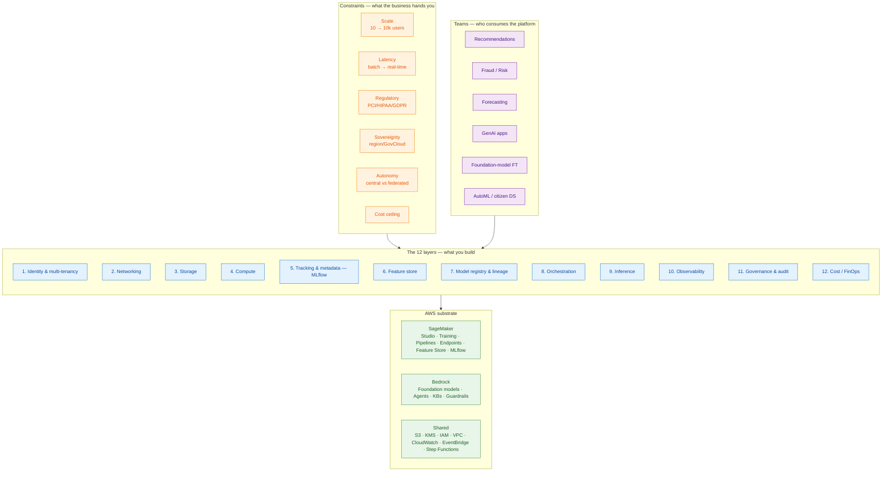

# ML Platforms on AWS — Architectural Deep Dives

> **Audience.** Platform architects, staff engineers, and engineering leaders who own (or are about to own) an internal ML/AI platform that must serve many teams with different workloads, risk profiles, and budgets.
>
> **Frame.** We assume an Amazon-scale organization: tens to hundreds of teams, mixed AWS accounts, real regulatory exposure, and both classical ML and GenAI workloads. MLflow is the connective tissue for tracking, registry, prompt management, tracing, and evaluation; SageMaker and Bedrock are the AWS-native compute substrates.

This series is intentionally written as if a small architecture council were producing it together — a platform tech lead, an infra/SRE lead, a security/compliance lead, an ML researcher, and a finance partner. Where they would disagree, we surface the tradeoff explicitly instead of papering over it.

## Reading order

You can read these in any order, but the natural progression is:

| # | Document | What it answers |
|---|---|---|
| 00 | [Architectural thinking](00-architectural-thinking.html) | How do we *think* about an ML platform before drawing boxes? |
| 01 | [The 12 platform layers](01-platform-layers.html) | What are the layers of a real ML/AI platform on AWS, and what does each one do? |
| 02 | [Team personas & scenarios](02-team-personas-and-scenarios.html) | What do twelve very different teams at an Amazon-scale company actually need? |
| 03 | [MLflow on SageMaker — deep dive](03-mlflow-on-sagemaker.html) | Concrete architecture: tracking server, training jobs, registry, endpoints, networking, IAM. |
| 04 | [MLflow with Bedrock — deep dive](04-mlflow-with-bedrock.html) | Tracing, prompts, evaluation, RAG, agents, guardrails — the GenAI stack. |
| 05 | [Constraints → architecture matrix](05-constraints-impact-matrix.html) | When a constraint changes, which layer moves and how? |
| 06 | [Multi-tenant platform patterns](06-multi-tenant-platform.html) | Account-per-team vs shared workspaces; the MLflow workspace model. |
| 07 | [Compliance & data residency](07-compliance-data-residency.html) | PCI, HIPAA, GDPR, GovCloud, air-gapped — what bends. |
| 08 | [Cost & FinOps for ML platforms](08-cost-and-finops.html) | Where the dollars go and how to keep them from leaking. |
| 09 | [Decision framework](09-decision-framework.html) | Trees, checklists, and the *reversible vs irreversible* lens. |

## A one-screen summary

The rest of this site is the long form of that picture.

## Two non-obvious framings we keep coming back to

1. **Constraints choose architectures, not the other way around.** Most "should we use X or Y" debates dissolve once you write down the constraint that *forces* the answer. We do this explicitly in [05](05-constraints-impact-matrix.html).
2. **The layer that moves the most when constraints change is rarely the one teams talk about.** Teams argue about model serving (layer 9). Constraints usually move identity (layer 1), storage (layer 3), and governance (layer 11) first, and serving last. Recognising this saves quarters of wasted work.

## How this connects to the rest of this site

- The MLflow internals — tracking, registry, tracing, ChatModel, gateway — are documented in the rest of `architecture-docs/`. Start at [the platform map](../index.html) if you need a refresher on *what MLflow is*.
- This `aws-platforms/` series is about *how to deploy MLflow inside a real AWS-based organization* and what the platform around it has to look like.

Continue with [Architectural thinking →](00-architectural-thinking.html).
