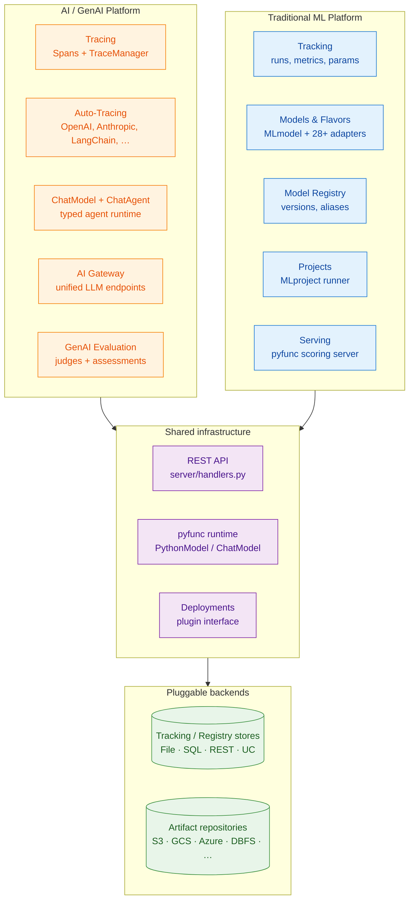

# MLflow Architecture — Deep Dive

This site is an architectural walkthrough of the two platforms that live inside this MLflow fork:

1. **[The Traditional ML Platform](ml-platform.html)** — experiment tracking, model packaging, model registry, projects, and serving.
2. **[The AI / GenAI Platform](ai-platform.html)** — tracing, prompt management, GenAI evaluation, LLM flavors, the AI Gateway, and the `ChatModel` agent runtime.

It is written for engineers who want to understand *how the pieces fit together* before reading source. Every section links to the concrete file paths and key class definitions in the repo, so you can jump from architecture into code.

## Platform map at a glance



## How to read this site

- Start with **[ML Platform](ml-platform.html)** if you are coming from a classical ML background (sklearn, XGBoost, PyTorch).
- Start with **[AI Platform](ai-platform.html)** if you are coming from LLM/agent work (OpenAI, Anthropic, LangChain, LlamaIndex, DSPy).
- The two platforms share the **same storage backends, REST API, artifact repositories, and model packaging format** — read both eventually, the boundary is intentionally thin.

## Concept deep dives

Each concept has its own page. Use these as references rather than reading top to bottom:

### ML platform
- [Tracking — runs, metrics, params, artifacts](concepts/tracking.html)
- [Models & Flavors — the universal packaging format](concepts/models-and-flavors.html)
- [Model Registry — versioning, stages, aliases](concepts/registry.html)
- [Projects — reproducible runs across backends](concepts/projects.html)
- [Serving & Deployments — the scoring server and plugins](concepts/serving.html)
- [Datasets & Artifact Repositories](concepts/data-and-artifacts.html)

### AI / GenAI platform
- [Tracing — Spans, the TraceManager, and OpenTelemetry](concepts/tracing.html)
- [Auto-Tracing Integrations — how 14+ libraries are instrumented](concepts/auto-tracing.html)
- [GenAI Evaluation — judges, assessments, traces](concepts/genai-evaluation.html)
- [ChatModel & Agents — the pyfunc agent runtime](concepts/chatmodel-agents.html)
- [AI Gateway — unified LLM endpoints](concepts/gateway.html)

## Cross-cutting architectural patterns

The two platforms share a small set of recurring patterns. Recognising them early makes the rest of the codebase fall into place:

| Pattern | Where it lives | Why it matters |
|---|---|---|
| **Store pattern** | `mlflow/store/tracking/`, `mlflow/store/model_registry/` | One `AbstractStore` interface, multiple backends (`FileStore`, `SqlAlchemyStore`, `RestStore`). Lets MLflow run anywhere from a laptop to a managed service. |
| **Flavor pattern** | `mlflow/<framework>/__init__.py` (sklearn, openai, langchain, …) | Every framework adapter exposes `save_model` / `log_model` / `load_model` and registers a `pyfunc` loader so any model is callable through one interface. |
| **Client / service / store** | `mlflow/tracking/client.py`, `mlflow/tracking/_tracking_service/client.py`, `mlflow/store/tracking/abstract_store.py` | Three layers: high-level client, RPC translation, persistence. Keeps the REST API and Python API coherent. |
| **URI-routed registries** | `mlflow/store/artifact/artifact_repository_registry.py`, `mlflow/tracking/_tracking_service/registry.py` | Schemes (`s3://`, `gs://`, `databricks://`) auto-route to the right backend. |
| **Auto-instrumentation via `safe_patch`** | `mlflow/utils/autologging_utils/safety.py` and every flavor’s `autolog()` | Both autologging (sklearn, XGBoost) and auto-tracing (OpenAI, Anthropic, LangChain) use the same monkey-patch utility under the hood. |

## What this site is not

- It is **not** the upstream MLflow user docs. The official docs at <https://mlflow.org/docs/latest/> cover the user-facing API surface.
- It is **not** auto-generated from docstrings. The Sphinx project under [`/docs`](https://github.com/SrikanthVelpuri/mlflow/tree/master/docs) does that.
- It **is** an opinionated architectural map, written from the perspective of someone reading the source.

## Source map at a glance

```
mlflow/
├── tracking/                # Experiment tracking client + fluent API
├── store/                   # Pluggable persistence (tracking, registry, artifacts)
├── models/                  # The universal Model class, signatures, MLmodel format
├── pyfunc/                  # Universal inference + ChatModel + scoring server
├── projects/                # MLproject runner + backends (Docker, K8s, Databricks)
├── deployments/             # Deployment plugin interface (incl. AI Gateway client)
├── tracing/                 # Spans, TraceManager, OTel bridge
├── entities/                # Domain objects: Run, Metric, Span, Trace, Model
├── server/                  # Flask app + REST handlers
├── gateway/                 # AI Gateway routes & schemas
├── data/                    # Dataset abstraction
├── evaluation/              # Eval, Assessment, judge orchestration
└── <flavor>/                # 28+ framework adapters (sklearn … openai … anthropic)
```

Continue with the **[ML Platform deep dive →](ml-platform.html)** or the **[AI Platform deep dive →](ai-platform.html)**.
